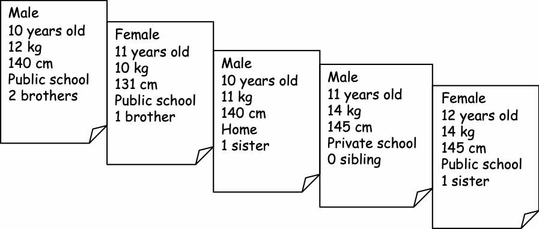
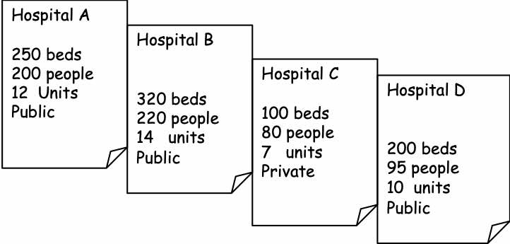
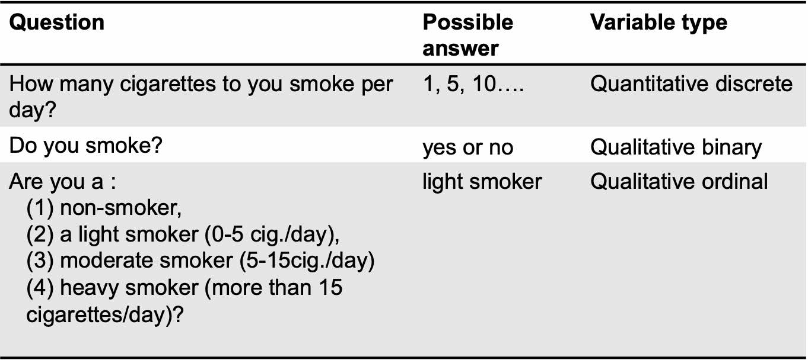
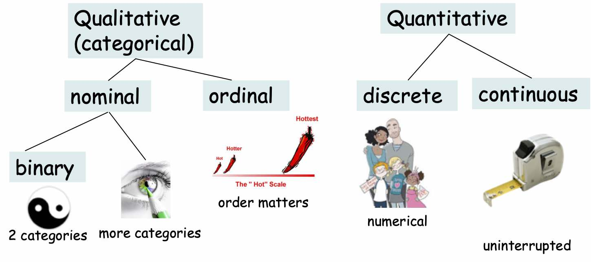

# Data: Statistical units and Variables {#variables}

```{block, type='objective'} 


  The `W's` and their types are what you should be interested in and careful about in the data:

 - Who
 - What 
 - Where
 - When
````

Statistics, from the latin `status` and same root as State, is the art of counting and classifying. At first, statistics were used to describe countable information on population. Rapidly they became essential to model and predict data from experiences to foresee outcomes and help decision making.  


## Statistical units

"Statistics is all about `variation`". 

In Public Health, we are interested in population. In biostatistics, we like to compare groups in a population. To that aim we need to identify our groups which will be composed of `statistical units`. For example, the statistical units could be:
 - patients, schooled children 
 - health care services
 - countries

```{block, type='definition'} 
The *Who* is the `statistical unit`, the unitary element of interest (individual, hospital, country...).
```

## Variables

The statistical units are characterized by one or more `variables`, which by definition varies between statistical units. 

```{block, type='definition'}
The *What* are `variables`, the recorded characteristics of the statistical units.
```

For example, the variables characterizing the schooled children could be: age, height, weight...(Figure \@ref(fig:fig1)). For health care establishments, the characteristics could be the legal status, the number of beds, nurses, doctors, patients...(Figure \@ref(fig:fig2)). 


```{r fig1, fig.cap='Individuals as statistical units', out.width='70%', fig.asp=.75, fig.align='center', echo=F}

```

```{r fig2, fig.cap='Hospitals as statistical units', out.width='65%', fig.asp=.75, fig.align='center', echo=F}

```

## Data storage

The information on each statistical unit can be stored and displayed in a data table. Typically, the *Who* of the table are found in the leftmost column and read row-wise. The *What* are stored in the remaining columns. Table \@ref(tab:HBSC) presents a snapshot of the HBSC data presented in the Introduction section (\@ref(intro)).  

```{r HBSC, echo=F}
hbsc<- read.csv("HBSC.csv", header=T, sep=",")
knitr::kable(
  head(hbsc[, c(1:5,8)], 10), booktabs = TRUE,
  caption = 'A table of the first 10 rows and first 8 columns of the HBSC data, France 2006.'
)
```


```{block, type='practice'}
Try to guess what these data represent and what information is available.  


**Hint:** Do not forget to read the title of the table.
```


```{block, type='definition'}
The *Where* and *When* are the context/location and time of the data collection. 
```


For instance in our HBSC the *When* is the year 2006 and the *Where* is in France. The scale of time and place are of great importance that need to be clearly defined. For example, the time can be a time point or a period of several months or years. As for France, it could be metropolitan France (excluding overseas departments) or France with all its departments. We could also look at different geographical levels like the city, the county, the state...  


Those information have to be reported in every titles of every tables and plots you will create from the data along with the *Who* and *What*. A table or a figure should be `self-explanatory` (self-content).  


## Variable types

Public Health data may come from various sources. For instance, they can be collected via interviews, surveys,or health information systems.  


In qualitative sciences, interviews are often based on open questions where answers are free text.  We will not discuss that case in this class. 


In quantitative sciences, surveys or records from health information systems are based on short queries where short answers with a finite range of possibilities are expected. For instance, let's say you are interested in tobacco consumption and plan a survey. You may ask the following questions with finite possibilities of answers:


```{r Tab1, tab.cap='Possible question to assess tabacco consumption', out.width='70%', fig.asp=.75, fig.align='center', echo=F}

```


Variables are of different types (Figure \@ref(fig:fig3)). When a variable is allowed to takes a limited number of categorical values, or categories, and answers questions about how cases fall into those categories, we call it a `categorical`, or `qualitative`, variable. When a variable corresponds to measured numerical values with units and the variable tells us about the quantity of what is measured, we call it a `quantitative` variable [@sharpe_business_2012].
The type of a variable will condition the statistical method chosen to summarize and describe your population of interest (Chapter \@ref(statdesc)).


```{r fig3, fig.cap='Different types of variables with example.', out.width='70%', fig.asp=.75, fig.align='center', echo=F}

```

The `categorical`, or `qualitative`, variables can be of two sub-types: the `nominal` and the `ordinal` variables. The nominal variables are for instance the colors of the eyes or various professions that count many categories. The nominal variables can also be `binary` with only two categories like smoking/non smoking or boys/girls. The ordinal variables take into account an ordering between the possible categories of the variables. For instance, a ordinal variable could be a scale of spiciness: neutral, middle, hot, very hot ! Note that this is suggestive. You can come up with a ranking where the intervals between the categories are not of equal width.  


The `quantitative` variables can be discrete or continuous. A quantitative discrete variable corresponds to numerical counts like the `number` of kids per household. A quantitative continuous variable corresponds to `measures` with potential decimals like the weight or height of pupils in the HBSC cohort.  


```{block, type='practice'}
Propose a set of variables, one of each type.
```

