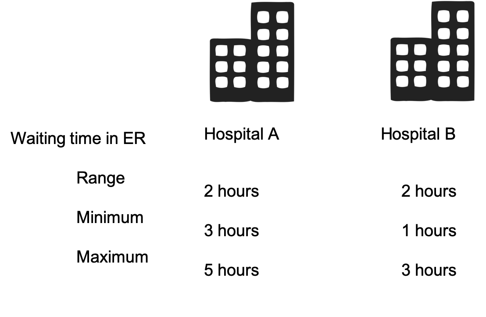
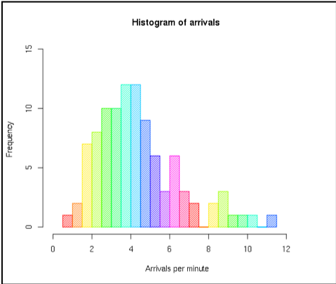

---
output:
  html_document: default
  pdf_document: default
---
# Descriptive statistics {#statdesc}

::: {.objective}
- Choose appropriate summary statistics (tables, graphics, parameters) to describe a population or a sample
- Interpret summary statistics
:::


## Frequency table 

One type of data statistical summary are `frequency table`, or `contingency table`.  


To summarize a `qualitative` variable, the frequency of the statistical units in each modality (category) of the variable is computed. The frequency can be reported as absolute count (absolute frequency) or proportion (relative frequency or count). For instance, in Table \@ref(tab:twoTable1) the partition of students according to the school status is summarized (HBSC dataset).  

```{r twoTable1, echo=F}
hbsc<- read.csv("HBSC.csv", header=T, sep=",")
Count <- table(hbsc[, 3]) 
Proportion <- prop.table(Count)*100
knitr::kable(
  addmargins(cbind(Count, Proportion), margin=1,  FUN = list(list(Total = sum))), booktabs = TRUE, col.names=c("Count","Proportion (%)"), 
  caption = 'Absolute frequency and relative frequency of pupils in each school type in the French HBSC database in 2006.'
)
```


In rows are the modalities (categories) of the variable "school status" in the original database and in columns are the frequency of students in each category. The first column is the `absolute frequency` or count and the second column is the `relative frequency` or proportion out of the total of students. The `margin total` is essential to display for quick assessment of potential mistake or missing values.  


To summarize a `quantitative` variable into a contingency table, the numerical values first need to be grouped into classes, generating in fact like a categorical variable. Next, the frequency of the statistical units in each group (class) of the new variable is counted.  


In Table \@ref(tab:twoTable2), first the quantitative variable *age* was used to create age groups and, next, the partition of students according to age group was summarized.  


```{r twoTable2, echo=F, eval=T}
AgeGroup <- table(hbsc[, 6]) 
names(AgeGroup)[1] <- "NA"
AgeGroupP <- prop.table(AgeGroup)*100
AgeGroup<- addmargins(cbind(AgeGroup, AgeGroupP), margin=1)
row.names(AgeGroup)[5] <- "Total"
knitr::kable(
  AgeGroup, booktabs = TRUE, col.names=c("Count","Proportion (%)"), 
  caption = 'Frequency table to summarize age distribution of children in the HBSC database, in France in 2006.'
)
```


One must read `[11-13[` as 11 years-old students being included (counted) in that group while 13 years-old students being excluded.  `NA` stands for Not Attributed or missing values.


When summarizing two (or more) variables in two-way (or more) table using frequencies via a statistical software you might have to look for the term `pivot table`. Table \@ref(tab:twoTable3) summarize in absolute frequencies the different age groups and the smoking status. For relative frequencies, you need to decide which way to count (Table \@ref(tab:twoTable4) and \@ref(tab:twoTable5)). You need to ask yourself: Who are you interested in? What is your denominator?   


```{r twoTable3, echo=F, warning=FALSE, message=FALSE}
library(dplyr)
library(kableExtra)
AgeSmoke <- addmargins(table(hbsc[, c("Age.group","SmokingStatus")])) 
rownames(AgeSmoke)[1] <- "NA"
rownames(AgeSmoke)[5] <- "Total"
knitr::kable(
  AgeSmoke, booktabs = TRUE, col.names=c("No","Yes","Total"), 
  caption = 'Repartition of smokers and non smokers among age groups in the HSBC sample, in France in 2006') %>%
  kable_styling("striped") %>%
  add_header_above(c("Age group" = 1, "Smoking Status" = 3))
```


```{r twoTable4, echo=F, warning=FALSE, message=FALSE}
AgeSmoke <- table(hbsc[, c("Age.group","SmokingStatus")])
AgeSmokeP1 <- round(addmargins(prop.table(AgeSmoke, margin=1)*100, margin = 2),2)
rownames(AgeSmokeP1)[1] <- "NA"
knitr::kable(
  AgeSmokeP1, booktabs = TRUE, col.names=c("No","Yes", "Total"), 
  caption = 'Proportion of smokers and non smokers among age groups in the HSBC sample, in France in 2006') %>%
  kable_styling("striped") %>%
  add_header_above(c("Age group" = 1, "Smoking Status" = 3))
```

Among the [15-17[ years old, 29.7% smoke.  


```{r twoTable5, echo=F, warning=FALSE, message=FALSE}
 AgeSmokeP2 <- round(addmargins(prop.table(AgeSmoke, margin=2)*100, margin = 1),2)
rownames(AgeSmokeP2)[1] <- "NA"
rownames(AgeSmokeP2)[5] <- "Total"
knitr::kable(AgeSmokeP2, booktabs = TRUE, col.names=c("No","Yes"), 
            caption = 'Relative distribution of age groups among smokers and non smokers in the HSBC sample, in France in 2006') %>%
            kable_styling("striped") %>%
            add_header_above(c("Age group" = 1, "Smoking Status" = 2))
```

Among the smokers, 65% are aged [15-17[ years old.  


The proportion of smoker seems to increase with age. We will verify this later using inferential statistics (see Chapter \@ref(tests))

## Central parameters

::: {.define} 
A central parameter, or location parameter, is the numerical value around which are distributed most of the values of a serie of data.
:::

### Mean

The  (arithmetic) mean is the most well known and commonly (but not always appropriately) used central parameter.

::: {.define}   
The arithmetic mean is the sum of the values divided by the number of values in the data serie.
:::


Mathematically, in a population the equation is:  


::: {.center}  
$\mu = ({\sum^{{i=N}}_{{i=1}} X_{i})/N}$
:::


In a sample, the equation is:  


::: {.center}    
$m = ({\sum^{{i=n}}_{{i=1}} x_{i})/n}$
:::

*Note: Greek letters are used for population and Roman letters for sample. The mean is also sometimes symbolized like $\bar{X}$ for population or $\bar{x}$ for sample*


Figure \@ref(fig:histogram) presents a `histogram` that summarize the distribution of weight of French student in the HBSC `sample` (for histogram definition see section \@ref(plot) and sample definition see \@ref(sample)). From the graphic, the central point (pick) of the distribution, around which values of the data serie are spread is around the weight class [40-45[ Kg.  


```{r histogram,  fig.cap='Distribution of weights (Kg) of 11 to 16 years-old students, in France in 2006', out.width='70%', fig.asp=.75, echo=FALSE, message=FALSE, warning=FALSE, fig.path = "fig/"}
library(ggplot2)
ggplot(hbsc, aes(Weight)) + geom_histogram(binwidth =5, fill='lightblue', color="black") + geom_vline(xintercept = 48, size = 1, colour = "#FF3721",linetype = "dashed")
```

On average, in 2006 the French students aged 11 to 16 weighted `r round(mean(hbsc$Weight, na.rm=T),0)` Kg (dashed red color).  


::: {.practice}    
Why the mean is not between 40 and 45Kg?
:::

The advantages:

- Easy to understand
- Easy to compute

The drawbacks:

- Sensitive to outlier: each value of the data serie count with the same weight
- Sensitive to the distribution shape

```{r salary, fig.cap='', out.width='70%', fig.asp=.75, fig.align='center', echo=F}
knitr::include_graphics('fig/salary.png')
```

### Median

The mean is not always the appropriate statistical indicator to summarize the distribution data and should be sometimes replaced by the median.  


::: {.define}  
The median is the middle value of a ordered data serie. The median split the data serie in two part of equal number of data.
:::


```{r mercuryMean, fig.cap='Mean or Median, that is the question?', out.width='70%', fig.asp=.75, fig.align='center', echo=F}
knitr::include_graphics('fig/MercuryMean.png')
```


In Figure \@ref(fig:mercuryMean),  50% of the statistical units, i.e 142 children hair sample, have mercury concentration below 1.8 $\mu g/g$ while  50%,  i.e 142 children hair sample, have mercury concentration above 1.8 $\mu g/g$.  


If you had rely on the mean you would have said that on average children hair contain 4 $\mu g/g$ of mercury which wrongly make you believe that represent most of the children case.  


How to compute a median?

- 1) Sort values in increasing order
- 2) If there are an odd number of observations, find the middle value
- 2'. If there are an even number of observations, find the middle two values and average them

::: {.practice}  
Would you use the median or the mean to compare French region rainfall?
:::

The advantages:

- Easy to compute
- Not sensitive to outlier
- Less sensitive to skewed distribution than the mean
- Easy to understand

The drawbacks:

- Sensitive to the distribution shape
- No idea of the minimum and maximum 
- Easy to understand but need to be explicitly exposed 


### Percentile and quantile

When looking at height distribution, the median is the exact middle value when people are ordered by height  which correspond to the 50$^{th}$ `percentile` or 50% below and above that value (Figure \@ref(fig:percentile)). But you could pick any percentile like the 80$^{th}$ with 80% below and 20% above. 

::: {.define}
The n$^{th}$ percentile of a set of data is the value at which *n* percent of the data is below it.
:::


```{r percentile, fig.cap='Percentile', out.width='70%', fig.asp=.75, fig.align='center', echo=F}
knitr::include_graphics('fig/percentile.png')
```

Percentiles can be calculated using the formula $n = (P/100)*N$, where *P* = percentile, *N* = number of values in a data set (sorted from smallest to largest), and *n* = ordinal rank of a given value.

::: {.practice}  
A student scores in the 75$^{th}$ percentile of his class. What does that mean?
:::

The 75$^{th}$ percentile is also the 3rd `quartile`. 

::: {.define} 
The quartile split the sorted data values into quarters.
:::

The quartiles are the values that frame the middle 50% of the data (median or Q2). One quarter of the data lies below the lower quartile, Q1 (25% or 25$^{th}$ percentile), and one quarter of the data lies above the upper quartile, Q3 (75% or 75$^{th}$ percentile).  


```{r quartile, fig.cap='Quartiles', out.width='70%', fig.asp=.75, fig.align='center', echo=F}
knitr::include_graphics('fig/quartile.png')
```

Using the R statistical software and the HBSC data set we can quickly describe the "Weight" variable of the French student aged 11 to 16 in 2006 with the `five-number summary`. The five-number summary provides a good overall look at the distribution of the data.  


```{r five-number}
summary(hbsc$Weight)
```

- There was 18 missing values (NA)
- The minimum weight was 24.5 Kg
- The maximum weight was 90 Kg
- The mean (average) is 48.09 Kg
- The median is 47 Kg meaning that 50% of the students weighted less than 47Kg and 50% of the students are heavier.
- The 1$^{st}$ quartile is 38.8Kg meaning that 25% of the students weighted less than 38.8Kg and 75% weighted more. 
- The 3$^{rd}$ quartile is 56Kg meaning that 75% of the students weighted less than 56Kg and 25% weighted more. 

:::  {.caution}
**Quantile algorithms**

Several algorithms exit to compute quantile (for instance see ?quantile in the R staistical software). They rely on different definitions of the underlying distribution of the sample: discontinuous or continuous.  


In your case no needs to go into the details but you should know how to interpret the values. 
:::


**Mean versus Median**  


If the data is normally distributed, i.e. bell shape, as statisticians like it (bottom of Figure \@ref(fig:distribution)), feel free to use the mean.he mean is easier to communicate and so if you can use it, use it. In fact the value of the mean should be really close the value of the median and the mode (or modal class).  


If your data is skewed (top of Figure \@ref(fig:distribution)), or there are large outliers, then use the median to find the centre of the data. Better yet, report both the mean and the median since any differences will reveal information about the presence of skew/outliers.  


```{r distribution, fig.cap='Bell shape distribution', out.width='70%', fig.asp=.75, fig.align='center', echo=F}
knitr::include_graphics('fig/distribution.png')
```


A more subtle rule: if you are more concerned with the total sum, rather than the typical value, use the mean. For instance, if you have a salary cap and you are interested in the average salary of your players, use the mean. In this case, the mean is biased towards the high earners, and you really care about the high earners because they are the ones who are eating up your salary cap.  


### Mode

::: {.define}
The most frequent value or modality
:::

It is the only statistical parameter for the `qualitative` variables.

```{r mode, echo=F, warning=FALSE, message=FALSE}
hbsc$SportsFrequency <- factor(hbsc$SportsFrequency, levels=c("NA", "never","less than once a month","once a month","2 or 3 times a week", "4 to 6 times a week", "every day"))
knitr::kable(table(hbsc$SportsFrequency), booktabs = TRUE, col.names=c("Sports frequency", "Number"),
            caption = 'Frequency of physical activities (sport) in the HSBC sample, in France in 2006') %>%
            kable_styling("striped")
```

In table \@ref(tab:mode) the mode is the category "2 or 3 times a week" with 175 students out of 500 practicing that much sports.  


For `quantitative` variables it could be a number or a class interval as in Figure \@ref(fig:histogram) where the modal class is [40-45[Kg.

::: {.caution} 
**Likert scale data**.  


A Likert Scale is a type of rating scale used to measure attitudes or opinions. Five to seven items are usually used in the scale.

In a survey with a 1-5 scale of "1-Very bad", "2-Bad", "3-Neutral", "4-Good" and "5-Very Good" categories, the mean result across many participants came out to be 3.5. But what does 3.5 even mean in this context? Half way between Neutral and Good : Neutood? In terms of best practice, use the median when describing the centre of Likert data. Some may even argue for only using the mode on Likert data. 
:::

## Variation parameters

::: {.define} 
A variation parameter is numerical value which describes the dispersion of all the values of a serie of data around its location parameter
::: 

### Range and IQR

The `range` is the difference between the minimum and maximum value of a data serie. It is better to report the boundaries rather then the output of the difference because otherwise we do not know from where it starts.

::: {.practice} 
In which hospital will you go for emergency care?
::: 


```{r range, fig.cap='Hospitals ER', out.width='70%', fig.asp=.75, fig.align='center', echo=F}

```

The `interquartile range (IQR)` summarizes the spread by focusing on the middle half of the data. It is defined as the difference between the two quartiles: $IQR = Q3 - Q1$. As the range, the IQR should be reported as an interval. For example, the five-number summary above on HBSC weight data show us that IQR is [38.8-56] Kg.

### Variance and standard deviation {#sd}

A powerful measure of spread is the distance of the values of a data serie to its mean.  

::: {.define} 
The variance is the average squared differences to the mean.
:::

Based on the mean, the `variance` is appropriate only for symmetric data and can be influenced by outlying observations.

Mathematically, if we tried to average the distances of all the values a data serie to its mean, the positive and negative differences would cancel each other out, giving an average deviation of 0-not very useful. Instead, we square each distance to get the `variance`.  


In a population the equation is:
```{block, type='center'}  
 $\sigma^2=\frac{\sum_{1}^{N}(X_i-\bar{X})^2}{N}$
```

where 

- $\sigma^2$ is the variance of population
- $X_i$ is the $i^{th}$ value in the population
- $\bar{X}$ is the mean in the population
- $N$ is the size of the population

In a sample, the formula is:

::: {.center} 
 $s^2=\frac{\sum_{1}^{n}(x_i-\bar{x})^2}{(n-1)}$
:::

where 

- $s^2$ is the variance of the sample
- $x_i$ is the $i^{th}$ value of the data serie
- $\bar{x}$ is the mean of the data serie
- $n$ is number of values in the data serie

The variance plays an important role in statistics, but as a measure of spread, it has a problem. Whatever the units of the original data, the variance is in squared units. To express the spread to in the same units as the data we take the square root of the variance. That gives the `standard deviation`.

::: {.define} 
A standard deviation is the square root of the variance, the average differences to the mean.
::: 


Mathematically, in a sample the formula is:

::: {.center}  
$s=\sqrt\frac{\sum_{1}^{n}(x_i-\bar{x})^2}{(n-1)}$
::: 


::: {.example}   
In the HBSC sample, one average pupils weight 48.09 Kg +/- 12.25Kg. It means that the **average variation** of the weights around the mean is of 12.25Kg. However some pupils can be lighter than 35.75kg (48-12.25 - the minimum is in fact 24.5Kg) and some pupils can be heavier than 60.25kg (48+12.25 the minimum is in fact 90Kg).
:::


## Graphical summary {#plot}

Graphical representations, as summary in tables, must be self-content and self-explanatory. They should be readable without text around. 

::: {.caution} 
**Plot title should include the W's**  

Who are you representing, What characteristics, Where and When it is happening.   
::: 

*Note: I will be intransigent on that matter* 

### Barplot

For one `qualitative` variable, the frequency `barplot`, or `barchart`, is the most appropriate plot. It could use the absolute or relative frequencies.

```{r barplot1, fig.cap="Repartition of students according to their sport activity level, in France in 2006 (source:HBSC)", out.width='70%', fig.asp=.75, fig.align='center', echo=FALSE} 
ggplot(hbsc, aes(SportsFrequency)) + geom_bar(color="lightblue", fill="lightblue")+ theme(axis.text.x = element_text(angle = 45, hjust = 1))
```

Figure \@ref(fig:barplot1) represents the distribution of students (*Who*) according to their sport activity level (*What*), in France (*Where*) in 2006 (*When*) and if available the source should also be cited (here HSBC) in the caption.  


It is a better practice to multiply plots that combining too many information in one plot. Imagine you would like to display the same information but for boys and girls. The below barplot is better than the next one as you can easily compare boys and girl but you also easily visualize the trend within each group.  


```{r barplot2, fig.cap="Repartition of students according to their sport activity level, in France in 2006 (source:HBSC)", out.width='70%', fig.asp=.75, fig.align='center', echo=FALSE} 
ggplot(hbsc, aes(SportsFrequency,fill=Gender)) + geom_bar() + facet_wrap(.~Gender) + theme(axis.text.x = element_text(angle = 45, hjust = 1))
```


```{r barplot3, fig.cap="Repartition of students according to their sport activity level, in France in 2006 (source:HBSC)", out.width='70%', fig.asp=.75, fig.align='center', echo=FALSE } 
ggplot(hbsc, aes(SportsFrequency, fill=Gender)) + geom_bar(position=position_dodge()) + theme(axis.text.x = element_text(angle = 45, hjust = 1))
```


### Pie chart

For one `qualitative` variable, you can also use a `pie chart`. However you should be careful on the number of modalities the variable to display can have: too few, the plot take lots of room for few information but too many you will rapidly get "the wheel of fortune".  


```{r pie, fig.cap="Repartition of students according to their sport activity level, in France in 2006 (source:HBSC)", out.width='70%', fig.asp=.75, fig.align='center', echo=FALSE } 
data <- hbsc %>% 
  group_by(SportsFrequency) %>% 
  count() %>% 
  ungroup() %>% 
  mutate(per=`n`/sum(`n`)) %>% 
  arrange(desc(SportsFrequency))
data$label <- scales::percent(data$per)

ggplot(data=data)+
  geom_bar(aes(x="", y=per, fill=SportsFrequency), stat="identity", width = 1)+
  coord_polar("y", start=0)+
  theme_void()+
  geom_text(aes(x=1, y = c(0.246, 0.408, 0.658, 0.850, 0.900, 0.99, 0.15), label=label))
```

My advice would be to avoid using that plot but if you absolutely need to use it do not forget to **display number and/or %** in the sectors of the plot so reader do not have to do the math.


### Histogram

For one `quantitative` variable, the `histogram` is often used to visualize the shape of the distibution of the data serie. Although one have to be careful of the bin width (breaks) use to group the numerical values.

```{r histogram2,  fig.cap='Distribution of students weight in France in 2006 (source: HBSC), binwidth=1', echo=FALSE, message=FALSE, warning=FALSE, out.width='70%', fig.asp=.75, fig.align='center'}
ggplot(hbsc, aes(Weight)) + geom_histogram(binwidth =1) 
```


```{r histogram3,  fig.cap='Distribution of students weight in France in 2006 (source: HBSC), binwidth=10', echo=FALSE, message=FALSE, warning=FALSE, out.width='70%', fig.asp=.75, fig.align='center'}
ggplot(hbsc, aes(Weight)) + geom_histogram(binwidth =10) 
```

Figures \@ref(fig:histogram2) and \@ref(fig:histogram3) present the same data serie but with a bin width of 1 and then 10. The shape of the plots are different, the modal class varies. With a bin width of 1 you have no summary and too many details while a bin width of 10 may be compact.  


There is no recipe, statistical software helps you with default algorithm but my advice would be to try a couple of bin widths and select the one you believe summarize the best the data   

::: {.caution}
**Barplot versus Histogram**  


Barplot are for `qualitative` data. The bars are separated.

Histogram are for `quantitative` data. The bins are joined. Gaps may occurred when no one fall in a particular bin. 
:::

If you want to compare the distribution of `one quantitative variable between more than 2 groups (qualitative)` the histogram remain interesting, as shown below. But up to three the comparison start to be difficult. A boxplot is then more appropriate. 

```{r histogram4,  fig.cap='Distribution of students weight by gender group in France in 2006 (source: HBSC)', echo=FALSE, message=FALSE, warning=FALSE, out.width='70%', fig.asp=.75, fig.align='center'}
ggplot(hbsc, aes(Weight, fill=Gender)) + geom_histogram(binwidth =5) + facet_grid(.~Gender)
```


### Boxplot

A boxplot helps presenting the five-number summary classically used to describe a sample.  


The central box shows the middle half of the data, between the quartiles. The top of the box is at the third quartile (Q3) and the bottom is at Q1, the height of the box is equal to which is the IQR. The median is displayed as a horizontal line. If the median is roughly centered between the quartiles, then the middle half of the data is roughly symmetric. If it is not centered,
the distribution is skewed. In extreme cases, the median can coincide with one of the quartiles.


```{r boxplot1, fig.cap='Boxplot elements', out.width='70%', fig.asp=.75, fig.align='center', echo=F}
knitr::include_graphics('fig/boxplot.png')
```


The whiskers reach out from the box to the most extreme values that are not considered outliers according to John W. Tukey's rule. The boxplot nominates points as outliers if they fall farther than 1.5*IQRs beyond either quartile. They may be mistakes or they may be the most interesting cases in your data. This rule is not a definition of what makes a point an outlier. It just nominates cases for special attention.  


```{r boxplot2,  fig.cap='Distribution of students weight by group of sport activity level, in France in 2006 (source: HBSC)', echo=FALSE, message=FALSE, warning=FALSE, out.width='70%', fig.asp=.75, fig.align='center'}
ggplot(hbsc, aes(Weight, SportsFrequency)) + geom_boxplot()
```

In Figure \@ref(fig:boxplot2) the distribution of students' weight vary by group of sport activity level. We note 3 extrema: 2 in the "2 or 3 times a week" group and 1 in the "once a month" group. Overall the boxplots overlap suggesting than on average the weights between groups might not be statistically different (see Chapter \@ref(tests)).  


Let's interpret the "never" group (bottom boxplot): around 50% of the students in that group weight 45Kg or less, 75% of the students weight 55Kg or less while 25% weight 55Kg or more

::: {.practice} 
What proportion of students lies between 42 and 55 Kg? 
:::

### Scatterplot

For two `quantitative` variables, a scatterplot is used to assess if there is a relationship between the two variables.

```{r scatterplot,  fig.cap='School results and BMI among students in France in 2006 (source: HBSC)',  echo=FALSE, message=FALSE, warning=FALSE, out.width='70%', fig.asp=.75, fig.align='center'}
ggplot(hbsc, aes(BMI, SchoolResults)) + geom_point() + ylab("School results (/20)")
```

Figure \@ref(fig:scatterplot) displays  the school results and BMI among students in France in 2006. It appears that there is no linear relationship between the two variables (see Chapter \@ref(tests) and \@ref(simplelm)).  

### Communication tips

::: {.caution}
**Avoid 3D plots** our eyes are not good at visualizing 3D and mathematically it's often wrong you do not manipulate volumes but numbers. 
:::

```{r badvisual1, fig.cap='Bad visual 1', out.width='50%', fig.asp=.75, fig.align='center', echo=F}
knitr::include_graphics('fig/badpic1.png')
```
 
```{r badvisual2, fig.cap='Bad visual 2', out.width='50%', fig.asp=.75, fig.align='center', echo=F}

```
  
::: {.caution} 
**Use appropriate colors** 

- Proscribe rainbow plots
- Sequential scale (gradiant) are suited to ordered data
- Diverging palettes put equal emphasis on mid-range critical values and extremes at both ends of the data range
-Qualitative palettes do not imply magnitude differences between legend classes, and hues are used to create the primary visual differences between classes.
- Do not forget our color-blind friends !
:::

What summary statistics should you use: tables, graphics or statistical parameters?  It all depends.  

Depend on the objective

- Return the data
- "take home message"

Depend on the audience

- Expert
- Everybody else

Depend on the data type

- Qualitative
- Quantitative

```{r visual, fig.cap='Communication tips', out.width='50%', fig.asp=.75, fig.align='center', echo=F}
knitr::include_graphics('fig/visual.png')
```

