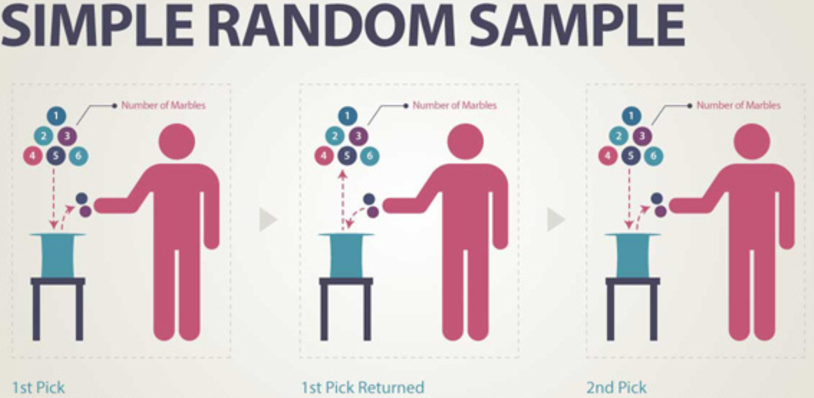
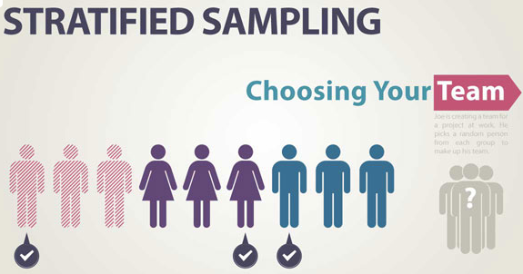
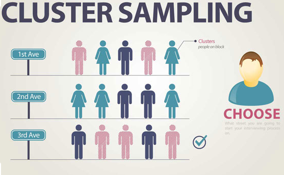
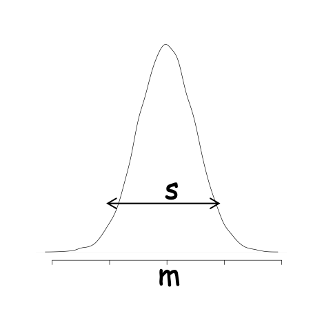
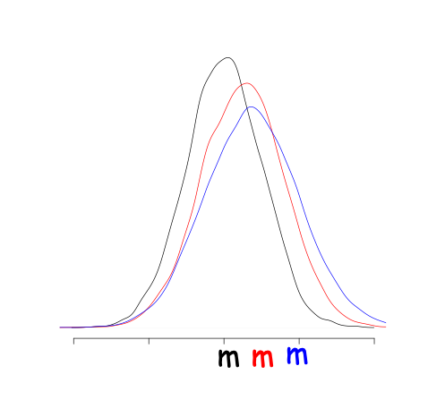
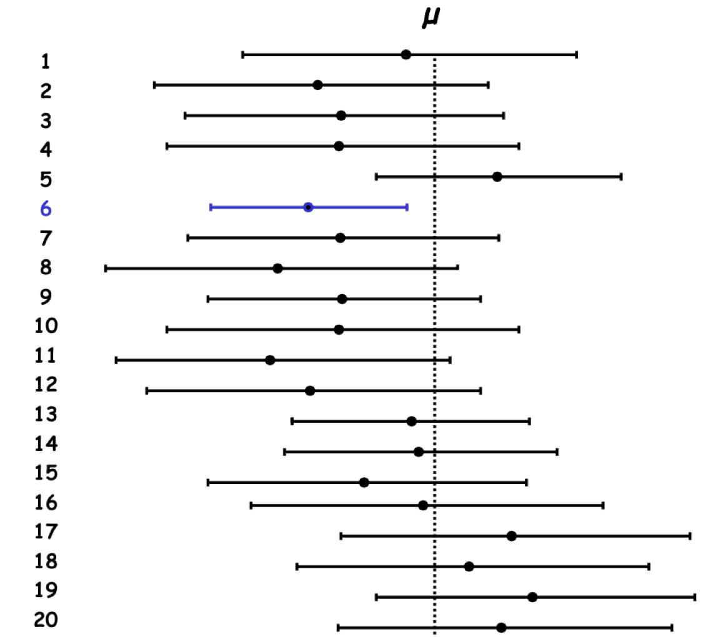

# Inference and sample {#inferencestat}

```{block, type='objective'} 
- Make the difference between individual variation and sample variation
- Make the difference between observed values and estimated parameters
- Interpret a confidence interval
- Interpret a statistical test
```


## Sample {#sample}

### Population versus Sample

Why take a sample ... to conclude on the population?  

```{r sample, fig.cap='Population versus Sample', out.width='70%', fig.asp=.75, fig.align='center', echo=F}
knitr::include_graphics('fig/sampling_F1.png')
```

When the population is small and isolated, like an Inuit village in Greenland for instance, it is relevant to study/interrogate the entire population to get the *exact* prevalence of a rare disease (Figure \@ref(fig:sample)).  

However if the size of the population is large we might not be able (want) to get it all! It is time consuming, costs a lot, and we are smarter. Although we will conclude on the population, a well design sample allows an *estimation* of the prevalence of the outcome of interest.  


What is the main property of a good sample?    

- Since we draw conclusions about a population based on the information obtained from a sample (subset of the population), it is important that the units of interest in the sample are **representative** of the entire population.
- A representative sample will allow to **confidently generalize** the results and the conclusion of your study  
- Poor sampling designs can yield misleading conclusions


```{block, type='definition'}  
- Set of observations drawn from a population
- All the individuals of the study population should have the same probability of being drawn
- A `representative sample` should be an unbiased reflection of what the targeted population is like for the units of interest (outcome and  covariates/determinants)
- A representative sample for a variable should reflect the variable distribution observed in the targeted population.

```

For example, you plan to determine the relationship between gratitude and job satisfaction in gynecologists. Your sample might consist of 30 to 40 gynecologists. Your population might be "gynecologists in the United States", or, if the scope of your study was more narrow, "gynecologists in New York City". So, if most gynecologists in the population are women, but your sample is all male, you do not have a good case for representativeness because your sample does not share the same characteristics as the larger population. In this case, you cannot generalize the results of your study to the population.


### Sample designs


Element selection technique  | *Probability sampling* | *Non-probability sampling*
------------- | ---------------------|--------------------------- 
Unrestricted  sampling   | Simple random sampling    | Convenience sampling (Voluntary response)
Restricted   sampling    | Complex random sampling (systematic sampling, stratified sampling)|  Purposive sample (such as quota sampling)

### Probability sampling

1. **Simple random sample** of size *n* consists of *n* individuals from the population chosen in such a way that every set of *n* individuals has an *equal chance* to be the sample actually selected.

The simple random sampling is **the gold standard**: All individuals are given an equal chance to be chosen to be in the sample. 

```{r randomSample, fig.cap='Simple random sample (source: Academic Web Services)', out.width='70%', fig.asp=.75, fig.align='center', echo=F}

```


2. **Stratified random samples** (or block experiment)  define by strata of similar characteristics and choose a separate simple random sample (SRS) in each stratum and combine these to form the full sample.

```{r stratified, fig.cap='Stratified sampling (source: Academic Web Services)', out.width='70%', fig.asp=.75, fig.align='center', echo=F}

```

3. **Cluster and multistage samples** consist of all or random units within clusters (hierarchical sampling)

```{r cluster, fig.cap='Cluster sample (source: Academic Web Services)', out.width='70%', fig.asp=.75, fig.align='center', echo=F}

```

For example, the HBSC study is based on a multistage sampling. In France, in each region some schools were randomly selected, within a school some classes were randomly selected and all the students of the selected class were interrogate.

```{block, type='practice'}
The Dean of the School of public health wants to meet with several members of the faculty of the Department of Statistics to discuss concerns they might have about their department. He does not have time to talk to all of the faculty members, but wants to be sure that he meets with faculty with various levels of seniority.  
The Department of Statistics is composed of:

18 Professors  
3 Associate Professors  
5 Assistant Professors  

The Dean decides to speak with 5 Professors, 2 Associate Professors, and 3 Assistant Professors. What sampling design can be used? 
```

4. **Systematic sampling**

Sometimes we draw a sample by selecting individuals systematically. For example, a systematic sample might select every tenth person entering a school cafeteria (price, food quality, opening hours...). To make sure our sample is random, we still must start the systematic selection with a randomly selected individual, not necessarily the first person entering the cafeteria at lunchtime. When there is no reason to believe that the order of people entering the pool could be associated in any way with the responses measured.


```{r systematic, fig.cap='Systematic sampling (source: Academic Web Services)', out.width='70%', fig.asp=.75, fig.align='center', echo=F}
knitr::include_graphics('fig/systematic_F6.png')
```


### Non-probability sampling

**Voluntary response survey** In a voluntary response sample, a large group of individuals is invited to respond, and all who do respond are counted. This method is used by call-in shows, Internet polls, Political party survey. Voluntary response samples are almost always biased, and so conclusions drawn from them are almost always wrong.


For example, the ABC news program Nightline once asked their viewers whether the United Nations should continue to have its headquarters in the United States. In order to have their opinions counted, viewers had to call a 1-900 number and pay a small fee. More than 186,000 callers responded and 67$\%$ said "No." The callers of such program tend to be strong headed and often negative opinions. A nationwide poll with a proper sampling design found that less than 28 $\%$ of US adults want the UN to move out of the United States.  


**Convenience sampling** chooses the individuals who are convenient, the easiest to reach to be in the sample. The group is probably not representative of the targeted population. This method is used in shopping area (street, mall). This population tend to be more affluent and include a larger percentage of
teenagers and retirees than the population at large.


```{r convenience, fig.cap='Convenience sample (source: Academic Web Services)', out.width='70%', fig.asp=.75, fig.align='center', echo=F}
knitr::include_graphics('fig/convenience_F5.png')
```

For example, you interview people at the mall or on a street corner about the French school policy that allows every cities to decide whether school schedule is spread over 4 or 5 days per week.   


Other non-probability sampling methods exists but are largely bias. One has to be aware and truthful when concluding on such samples. 


```{r nonprob, fig.cap='Non-probability sampling methods', out.width='70%', fig.asp=.75, fig.align='center', echo=F}
knitr::include_graphics('fig/nonprob_F7.png')
```


### Sampling bias

When a sample is biased, the summary characteristics of a sample differ from the corresponding characteristics of the population it is trying to represent.  


- Undercoverage: some portion of the population is not sampled at all or has a smaller representation in the sample than it has in the population.
- Non-response: those who don???t respond may differ from those who do
- Comparability
- Wording of questions: influence the answers by presenting one side of an issue consciously or not
- Response bias: tendency to please the interviewer


## Confidence intervals 

### Within and between sample variation
```{r pop2sampl, fig.cap='Parameter estimation from sample to population', out.width='70%', fig.asp=.75, fig.align='center', echo=F}
knitr::include_graphics('fig/pop2sample.png')
```


```{r withinvar, fig.cap='Variation of individuals within a sample', out.width='50%', fig.asp=.75, fig.align='center', echo=F}

```

As shown in Figure \@ref(fig:withinvar), individual measures vary with a sample. The standard deviation $s$ is a indicator of that `individual fluctuation`. It is the average distance of the measures of the individuals to the mean.  


```{r betweenvar, fig.cap='Variation between a samples drawn from the same population', out.width='50%', fig.asp=.75, fig.align='center', echo=F}

```

If you drawn different samples from the same population you will get different means (Figure \@ref(fig:betweenvar)) due to `sampling fluctuation` or `sampling distribution of the mean`. This variance between the means of different samples can be estimated by the standard deviation of this sampling distribution and it is the standard error (SE) of the estimate of the mean. 

```{block, type='definition'}
The standard error (SE) is a type of standard deviation for the distribution of the means of samples drawn from the same population.
```

Standard Error:
```{block, type='center'}  
$\sigma_\mu = s/\sqrt{n}$
```

where:

- $\sigma_\mu$ standard error of the mean
- $s$ standard deviation of the sample (\@ref(sd))
- $n$ size of the sample

### The CLT and the confidence interval

The mean $m$ in a sample of size $n$ is a random variable, which varies between samples. This random variables should follow a Normal distribution centered around $\mu$, the true mean of the population. This is the `central Limit Theorem`.

```{r estimatedmu, fig.cap='The observed mean is a random variable', out.width='70%', fig.asp=.75, fig.align='center', echo=F}
knitr::include_graphics('fig/estimatedmu.png')
```


```{block, type='definition'}  
**Central Limit Theorem (CLT)**  

The mean of a random sample has a sampling distribution whose shape can be approximated by a Normal model. The larger the sample, the better the approximation will be.
````

For example, in the HBSC survey  the observed mean of weights of 11 years-old French children in 2006 in our sample (n=500) is  38, 55 Kg (s = 8,10 Kg). How do we estimate the **TRUE value** in the population of children aged 11 in 2006 in France?

Using central limit theorem, one can demonstrate that **we can be 95% confident that the true mean $\mu$ of the population from which is extracted our sample is within the interval**:

```{block, type='center'}  
$m-1.96*\sigma_\mu \leq \mu \leq m+1.96*\sigma_\mu$
````

where:

- $\sigma_\mu$ standard error of the mean
- $m$ mean of the sample
- 1.96 multiplier coefficient that depends on the confidence level expected 


Following the example, the CI95% will be [37.40Kg-39.85Kg].

Similarly the proportion $p$ in a sample of size $n$ is a ramdon variable, which varies between samples. This random variables follows a Normal distribution centered around $\pi$.

For example, you are interested in the proportion of children (aged 2-3) with sleeping disorder in Isere, France (population: 14 000 children of 2 or 3 years old). You built a sample of 540 children among which 86 had sleeping disorder. The proportion of children with sleeping disorder in our sample is $p=16$%. But what is the TRUE proportion of children (aged 2-3) with sleeping disorder in Isere?   


Using central limit theorem, one can demonstrate that **we can be 95% confident that the true proportion $\pi$ of the population from which is extracted our sample is within the interval**:

```{block, type='center'}  
$p-1.96*\sigma_\pi \leq \pi \leq p+1.96*\sigma_\pi$
````

where:

- $p=k/n$, $k$ is the number of entities with the characteristic and $n$ the size of the sample
- $\sigma_\pi$ standard error of a proportion $\sqrt{p(1-p)/n}$
- 1.96 multiplier coefficient that depends on the confidence level expected 

Following the example, the CI95% will be [12.9% ; 19.1%].

### Interpretation of confidence intervals

**The true mean is or is not in your estimated confidence interval**. At 95% confidence, You took an 5%-risk of having the wrong confidence interval.

```{r confin95, fig.cap='Confidence interval estimation from 20 samples drawn from the same population.', out.width='50%', fig.asp=.75, fig.align='center', echo=F}

```

In Figure \@ref(fig:confin95), 19 out of 20 samples (95%) from the same population will produce confidence intervals that contain the TRUE population parameter. There is a 95% probability that the calculated confidence interval encompasses the true value of the population parameter

For example, in the HBSC sample and the age group [11-13[ years old, the mean weight is `r round(mean(hbsc$Weight[hbsc$Age.group=="[11-13["], na.rm=T),2)`Kg. But what is the true mean in the population?

```{r ci95, echo=F, quiet=T, warning=FALSE,message=FALSE}
library(epiDisplay)
ci(hbsc$Weight[hbsc$Age.group=="[11-13["])
```

where:

- $n$ is the size of the sample
- $sd$ standard deviation of the sample
- $se$ standard error of population mean
- $lower95ci$ lower bound of the 95% confidence interval
- $upper95ci$ upper bound of the 95% confidence interval


We cannot give a unique true answer but only an interval (an estimation) with a certain confidence. We will say that in our sample the punctual estimate of the mean of weights for student aged 11 in France in 2006 was 38.60 kg and that we are 95% confident that in 2006, among the entire population of 11 year-old French student, the mean of weights is between 37.40Kg and 39.85Kg (CI95% [37.40Kg-39.85Kg]).

For the proportion example, we are 95% confident that the true proportion of children, aged 2-3, with sleeping disorder in Isere is between 12.9% and 19.1%.

### Why 1.96? 

We can generalize the equation above to:

```{block, type='center'}  
$m-Z_\alpha\sigma_\mu \leq \mu \leq m+Z_\alpha\sigma_\mu$
````

where:

- $Z_\alpha$ is the critical value of the Normal distribution (centered on $\mu=0$, reduced to $\sigma=1$) where $100-\alpha$ % of the values stand within $Z$ standard deviations of the mean.

```{r Zalpha, fig.cap='Centered reduced Normal distribution.', out.width='40%', fig.asp=.75, fig.align='center', echo=F}
knitr::include_graphics('fig/Zalpha.png')
```


```{block, type='practice'}  
The critical value $Z_\alpha$ will be larger or smaller when computing a confidence interval at 90?
````


### Precision or Margin error

The term $Z_\alpha\sigma_\mu$ or $Z_\alpha\sigma_\pi$ is noted $i$ and named the `precision` or `margin error` of the confidence interval. 


```{block, type='caution'}  
In a simple random sample, the precision is proportional to the square root of the inverse of the sample size. It is not linear!
```

```{r precision, fig.cap='Precision to sample size relationship in a simple random sample.', out.width='60%', fig.asp=.75, fig.align='center', echo=F}
knitr::include_graphics('fig/precision.png')
```

For example, what should be the size of the sample to estimate the prevalence of overweight children aged 12, in Haute Savoie with a precision of $i$ knowing from the literature that the estimate prevalence is 17%?  


From the equation of the confidence interval of a proportion is $n=P(P-1)Z_\alpha^2/i^2$   

For a precision of 3%, $n = 0.17(1-0.17)*1.96^2/0.03^2 = 627$  


For a precision of 1%, $n = 0.17(1-0.17)*1.96^2/0.01^2 = 5644$ !!!  
