# Inference and statistical tests {#tests}

:::{.objective}
- Understand statistical test reasoning
- Interpret results of a statistical test
- Discuss significance of a statistical test
:::

The aim of a statistical test is to reach a scientific decision on a difference (or effect), on a
probabilistic basis, based on observed data.

When assessing differences between groups (*Who*), you have to define *What* to compare. According to the type of the variable, you will choose a statistical parameter (mean, proportion, data distribution) to perform the comparison. The comparison will be based on hypothesis, with possible assumption to verify, and the associated statistical test.  


In summary, the procedure is as follow:

1. Formulate hypothesis to be tested
2. Choose the appropriate statistical test
3. Calculate the appropriate statistic measure
4. Interpret the result

## Formulate a hypothesis

In **hypothesis formulation** you always have two possibilities: **it is not different OR it is different**.


In the HBSC data, we are interested in the characteristics of the smoking students compare to the non-smoking. Do they differ by some characteristics?

::: {.example}
We would like to test whether there is, on average, a difference in height between smokers and non-smokers.
::: 

::: {.example}
We would like to test if the proportion of smokers varies by gender.
::: 

First, we describe the distribution of the variable between the groups.  


In example 5.1, the height is a quantitative continuous variable which can be summarized by the mean (Table \@ref(tab:smokeheight)). In our sample, the students who do not smoke measure on average 157 cm while the students who smoke measure in average 166 cm. The question is "At the population level, is that different knowing that you do have individual variation (SD) and sample variations (SE)?".    


```{r smokeheight, echo=F, message=FALSE}
library(dplyr)
hbsc<- read.csv("HBSC.csv", header=T, sep=",")
smokeheight<- hbsc %>% group_by(SmokingStatus) %>% summarise("Mean"= round(mean(Height, na.rm=TRUE),2),
                                               "SD"= round(sd(Height, na.rm = TRUE),2),
                                               "Median"= median(Height, na.rm=TRUE),
                                               "Q1"= quantile(Height, 0.25, na.rm=TRUE),
                                               "Q3"= quantile(Height, 0.75, na.rm=TRUE)) 
smokeheight <- smokeheight[-3,]
knitr::kable(
  smokeheight, booktabs = TRUE,  
  caption = 'Description of the Height (cm) variable by smoking group (0=non-smoking, 1=smoking) in the French HBSC database in 2006.'
)
```

In example 5.2, the gender is a qualitative variable which can be summarized into proportions (Table \@ref(tab:smokegender)). In our sample, the proportion of students *seem* to different between groups. The question is "At the population level, are those proportions real different knowing that you do have individuals' variation (*sd*) and sampling variation (*se*)?".    


```{r smokegender, echo=F, message=FALSE}
library(tidyr)
library(kableExtra)
smokegender<- hbsc  %>% 
  group_by(Gender, SmokingStatus) %>%
  filter(Gender!="" & SmokingStatus!="NA") %>% 
  summarise(n = n()) %>%
  mutate(freq = round(n / sum(n)*100,2))
 
twfreq <-  smokegender[,-3] %>%
  spread(SmokingStatus, freq) 

twcount <-  smokegender[,-4] %>%
  spread(SmokingStatus, n)

knitr::kable(
  twfreq, booktabs = TRUE,  col.names=c("Gender","No","Yes"),
  caption = 'Proportion of students smoking (1) or non-smoking (0) by gender in the French HBSC database in 2006.')  %>%  add_header_above(c(" " = 1, "Smoking status" = 2))
```


**In theory**, we test whether the two groups (samples) come from the same population (Figure \@ref(fig:meancomparison)). For instance, sample 1 with mean *m1* from population 1 with $\mu_1$ is coming from the same population as sample 2 with mean *m2* from population 1 with $\mu_2$. Population 1 is equal to population 2. 

```{r meancomparison, fig.cap='Population versus Sample', out.width='70%', fig.asp=.75, fig.align='center', echo=F}
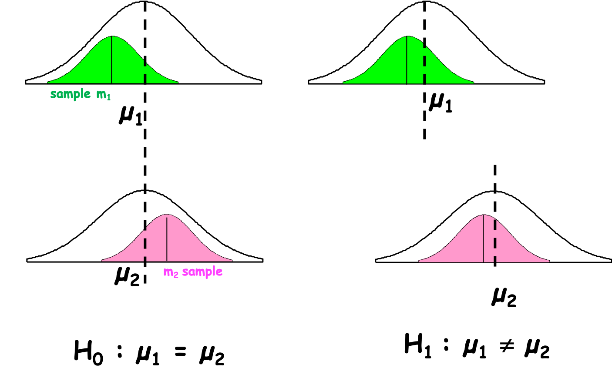
```

When you state the hypothesis you should explicit H0 an H1. 

::: {.definition}
  

**H0** : The null hypothesis is that the parameters are EQUAL, i.e they are not different.

**H1**: The alternative hypothesis is that the parameters are NOT EQUAL, i.e they are different.
::: 

I like to write down the hypothesis with the $=$ sign and $\neq$ as I find easier to pick the test and interpret the results afterward.

Remember the **W's** they should appear in the hypothesis if you have the information.

::: {.example}

We would like to test whether there is, on average, a difference in height between smokers and non-smokers.  

H0: In France in 2006, the mean height of the students 11-16 who smoke was equal to the mean height of the students 11-16 who do not smoke.  


H1: In France in 2006, the mean height of the students 11-16 who smoke was NOT equal to the mean height of the students 11-16 who do not smoke.
::: 

::: {.example}
We would like to test if the proportion of smokers varies according by gender.  

H0: In France in 2006, the proportion of student girls aged 11-16 in the smoker group was equal to the proportion of student girls aged 11-16 in the non-smoker group

H1: In France in 2006, the proportion of student girls aged 11-16 in the smoker group was NOT equal to the proportion of student girls aged 11-16 in the non-smoker group
::: 


A statistical test is always performed to answer the H0 hypothesis (Figure \@ref(fig:testH0rule)).  


- When we prove that the statistical parameters differ we reject H0 and accept H1. We say that we observed a statistically significant difference between the parameters.
- When we cannot prove that the statistical parameters differ, we stay under H0 and say that:  **we fail to reject H0** because we cannot show any statistically significant difference. H0 is never accepted as an error risk still exists that we can not compute.  


```{r testH0rule, fig.cap='Statistical test interpretation', out.width='70%', fig.asp=.75, fig.align='center', echo=F}
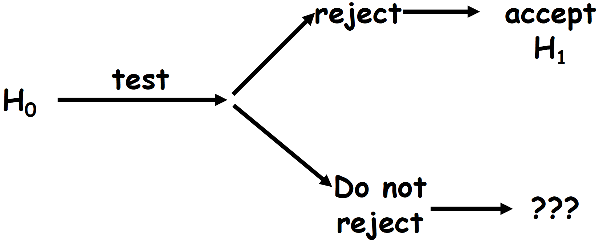
```


## Comparison of two means

Once the hypothesis are stated, we choose a test. In the context if the comparison of means, the test will assess whether the observed difference ($\Delta$) between the two groups is random (due to individuals' and sampling variations) or not (Figure \@ref(fig:meandelta)).

In theory, if H0 is true $\Delta = m_1 - m_2 = 0$  


```{r meandelta, fig.cap='Population versus Sample', out.width='70%', fig.asp=.75, fig.align='center', echo=F}
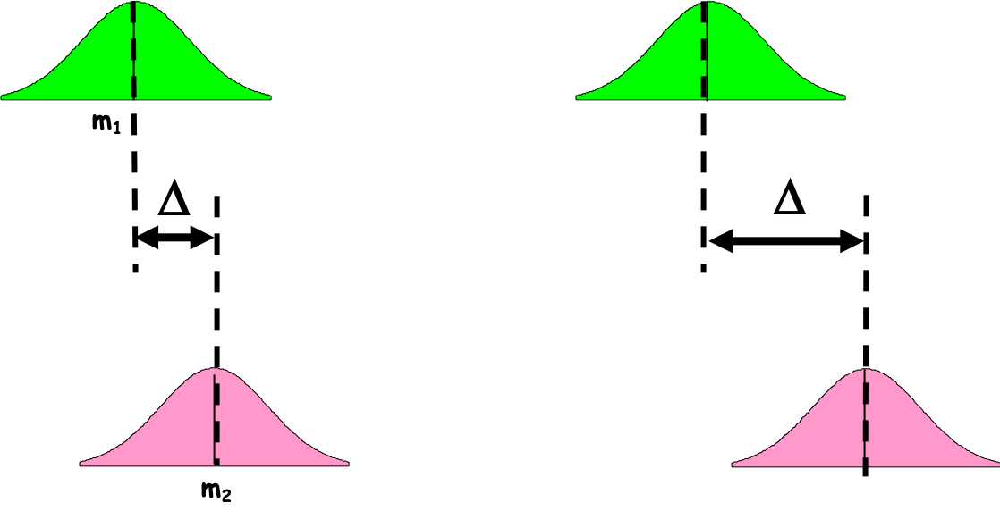
```


But we never compare $\Delta$ to 0 as we need to take into account the individuals' fluctuation (*sd*) and sampling (*se*) variation. What is the critical value, then ? Can you guess ?  


The critical value depends on the risk you are willing to take to conclude about a difference
that does not exist in reality, the $\alpha$ risk.


When comparing means, you make the assumption that your sample's distributions are not too different from a Normal distribution. Therefore, the difference $\Delta=m_1-m_2$ should follow a Normal distribution centered on 0. Then to take into account the individuals and sampling variation, the difference is standardized. The  statistical value  $(m_1-m_2)/s_\Delta$ is computed  and compare to the critical value $Z_\alpha$ of the centered reduced Normal distribution for a risk $\alpha$. [Note $s_\Delta$ is function of the chosen test]

For a risk $\alpha=5$% the critical value is  $Z_\alpha=1.96$.   


If H0 is true, 95% of values of $(m_1-m_2)/s_\Delta$  are between -1.96 and 1.96. If the statistical value  $(m_1-m_2)/s_\Delta$ returned by your test is above 1.96 or below -1.96, you reject H0 and accept H1. 

::: {.practice}
In example 1, the statistical value for a risk $\alpha=0.05$ is -5.4582. What is you conclusion?
::: 

## Comparison of two proportions

In the context of proportion comparison like in example 2, the objective is to assess whether the proportion of cases among the exposed group is equal to the proportion of cases among the non-exposed group.

::: {.example}
We would like to test if the proportion of smokers varies by gender.  

H0: In France in 2006, the proportion of student boys aged 11-16 in the smoker group was equal to the proportion of student girls aged 11-16 in the smoker group

H1: In France in 2006, the proportion of student boys aged 11-16 in the smoker group was NOT equal to the proportion of student girls aged 11-16 in the smoker group
::: 


To this aim, we will compute the standardized differences (distances) between groups.

### Chi-square test

The Chi-square is often the test used as rather intuitive and non computer greedy.

First, we compute a two-way table with your `observed counts`:

```{r chisquare1, echo=F, warning=FALSE}
twcount$Total <- rowSums(twcount[,2:3])
colnames(twcount) <- c("Gender","No","Yes", "Total")
twcount <- twcount %>% ungroup() %>% add_row(Gender="Total", No=432, Yes=67, Total=499)

knitr::kable(
  twcount, booktabs = TRUE,  col.names=c("Gender","No","Yes", "Total"),
  caption = 'Observed number of boys and girls students smoking or not in the French HBSC database in 2006.')  %>%  add_header_above(c(" " = 1, "Smoking status" = 3))
```

Under H0 the absence of difference (independence assumption), we would expect to have the same proportion of smokers among the girls and the boys. So keeping the total margins what would be the expected counts? (Table \@ref(tab:chisquare2))   


```{r chisquare2, echo=F, warning=FALSE}
twexpectedcount <- as.data.frame(cbind("No"=c("?", "?", 432), 
                                 "Yes"=c("?", "?", 67), 
                                 "Total"=c(251, 248, 499)))
row.names(twexpectedcount) <- c("boy","girl", "Total")

knitr::kable(
  twexpectedcount, booktabs = TRUE,
  caption = 'Expected number of boys and girls smoking or not in the French HBSC database in 2006.')  %>%  add_header_above(c(" " = 1, "Smoking status" = 3)) 
```

To compute a theoretical two-way table with your `expected counts`:  

- the proportion exposed students is: $p= 67/499= 0.134$, *i.e* 13.4%. 
- the number of boys students exposed would be: $p= (67/499)*251 = 33.7$.  


```{r chisquare3, echo=F, warning=FALSE}
twexpectedcount <- as.data.frame(cbind("No"=c("?", "?", 432), 
                                 "Yes"=c("(67/499)*251", "?", 67), 
                                 "Total"=c(251, 248,499)))
row.names(twexpectedcount) <- c("boy","girl", "Total")

knitr::kable(
  twexpectedcount, booktabs = TRUE,
  caption = 'Expected number of boys and girls smoking or not in the French HBSC database in 2006.')  %>%  add_header_above(c(" " = 1, "Smoking status" = 3)) 
```


```{r chisquare4, echo=F, warning=FALSE}
twexpectedcount <- as.data.frame(cbind("No"=c("217.3", "214.7", 432), 
                                 "Yes"=c("33.7", "33.3", 67), 
                                 "Total"=c(251, 248,499)))
row.names(twexpectedcount) <- c("boy","girl", "Total")

knitr::kable(
  twexpectedcount, booktabs = TRUE,
  caption = 'Expected number of boys and girls students smoking or not in the French HBSC database in 2006.')  %>%  add_header_above(c(" " = 1, "Smoking status" = 3)) 
```

Then we compute the Chi-square ($\chi^2$) statistic which is the standardized sum of the differences between the observed and the expected values.

::: {.center}
$\chi^2_{Obs}= \sum(\dfrac{(Obs-Exp)^2}{Exp}$
::: 

Using the R statistical software, we have
```{r computeChi2}
chisq.test(hbsc$Gender, hbsc$SmokingStatus)
```

The $\chi^2_{Obs} = 0.54$. Now the question is:  


"Is $\chi^2_{Obs}$ equal to 0?"  

As for the comparison of means, in theory, if H0 is true $\chi^2_{Obs} \sim 0$  but it is never 0. There are variations and we test H0 with a $\alpha$ risk. Therefore, what is the threshold?


To define that threshold, we need to choose the correct statistical law. The $\chi^2$ distribution depends on *k*, the number of degrees of freedom (df) which depends on the number of characteristics of the two variables we are comparing (Figure \@ref(fig:chi2-distrib)).
 
 
```{r chi2-distrib, fig.cap='Chi2 distribution depends on the degree of fredom K', out.width='70%', fig.asp=.75, fig.align='center', echo=F}
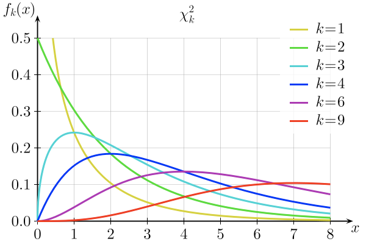
```

When the two-way table of the expected number is drawn, the degree of freedom is the number of values in the final calculation that are free to vary. For instance, in a 2x2 table once you have set one value the others cannot change. The quick formula to compute the degree of freedom (df) for the $\chi^2$ distribution is the number of rows in the table minus 1 multiply by the number of columns in the table minus 1:

::: {.center}
df = (#rows - 1) * (#cols - 1)
::: 


::: {.practice}
For a 2x3 table, what is the degree of freedom?
::: 


Next, we need to look at the statistical table of the $\chi^2$ law (Figure \@ref(fig:chi2-table)). The threshold value also depends on the $\alpha$ risk you are willing to take.

```{r chi2-table, fig.cap='Chi2 distribution depends on the degree of fredom K', out.width='70%', fig.asp=.75, fig.align='center', echo=F}
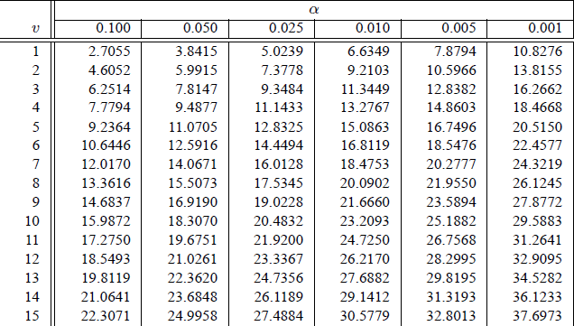
```

In the $\chi^2$ table, for our 2x2 table the $df = 1$ and for a $\alpha$ risk of 5%, the $\chi^2_{Theo}= 3.84$.   

Next the decision rule using the p-value is the same as for the comparison of means.

::: {.practice}
In the example, the statistical value for a risk $\alpha=0.05$ and $df=1$ is 3.84. The $\chi^2_{Obs} = 0.54$.  What is you conclusion?
::: 

::: {.caution}
To correctly use the $\chi^2$ test and have accurate estimation of the associated probabilities, we need to have at least **n=5** count in each cell of the **table of expected** numbers.
::: 

### Fisher's Exact test

To compare proportions the Fisher's Exact test is even better than $\chi^2$ as it computes the exact probability of obtaining a difference even greater if H0 is true. However the formula is more complex and difficult to compute by hand . A computer is highly recommended (Table \@ref(tab:FisherTab)).

```{r FisherTab, echo=F, warning=FALSE}
FisherTab <- as.data.frame(cbind("No"=c("a", "b", "t1"), 
                                 "Yes"=c("c", "d", "t2"), 
                                 "Total"=c("n1", "n2", "N")))
row.names(FisherTab) <- c("boy","girl", "Total")

knitr::kable(
  FisherTab, booktabs = TRUE,
  caption = 'Fisher Exact test principal.')  %>%  add_header_above(c(" " = 1, "Smoking status" = 3)) 
```

::: {.center}
$p = \dfrac{n_1!n_2!t_1!t_2!}{a!b!c!d!}$
::: 


Using the R statistical software, we have
```{r computeFisher}
fisher.test(hbsc$Gender, hbsc$SmokingStatus)
```

How to read the output of the Fisher's Exact test?  

1) We can look at the odds ratio and the confidence interval (95% CI)


As it is a ratio (numerator/denominator) if there is no difference (numerator=denominator) the $odds ratio \sim 1$. However it is never 1, we need to look at the confidence interval (at a certain risk level) to conclude.  


- If the confidence interval includes 1, we fail to reject H0, we can not conclude that the proportions differ.
- If the confidence interval does not include 1, we reject H0, the proportions differ.

::: {.practice}
In the example, the Fisher's exact test returns an odds ratio of 0.79 and 95% CI [0.45, 1.37]. What is your conclusion?
::: 


2) We can look at the $p-value$ but what is a $p-value$ ? See next section \@ref(alpha-p).


## Risk $\alpha$ and $p-value$ {#alpha-p}

The demonstrations above and the use of $Z_\alpha$ or $\chi^2_\alpha$ values are valid for comparison of means or proportions under some assumptions and conditions ($Z_\alpha$ with sample size above 30 in each group; $\chi^2_\alpha$ function *df*...). What is happening for other tests?  


The philosophy is exactly the same but the critical value might come from other statistical laws than the Normal law  (Chi-square, Binomial, Poisson...). It might be difficult to retrieve the critical value need to compare to your computed statistical value.  There are more statistical tables that there are statistical tests.


The common practice is then to compare the risk $\alpha$, defined *a priori*, to the $p-value$ returned by the test *a posteriori*.We want to know the ultimate risk that is taken. Meaning, the risk corresponding to the value found by the test.


::: {.define}

**$\alpha$ risk and $p-value$ **  


$\alpha$ risk: *a priori* risk to conclude about a difference that does not exist in reality  


$p-value$:  *a posteriori* error risk that is taken knowing the result of the test
::: 


::: {.define}

**Statistical test's decision rule**

When $p-value$ > $\alpha$ risk, we FAIL to reject H0

When $p-value \leq  \alpha$ risk, we reject H0
::: 

The $p-value$ is not synonymous of the importance of the possible difference between groups. In other words, a very small p-value means that the risk of making a mistake is very low. It does not mean that there is a huge difference between groups.

::: {.example}
**Example 3:** Using 2 studies we are assessing 2 new methods (A and B) for the prevention of surgical site infections (SSI) compared to a conventional method (0).  


- In study A: method A shows 12% of SSI and the conventional method 24% of SSI. The test between A and 0 returns a $p-value \leq 0.05$.
- In study B: method B shows 12% of SSI and the conventional method 24% of SSI. The test between B and 0 returns a $p-value \leq 0.001$

Is method B better than method A in preventing SSI?  
::: 

In the example above, we cannot tell if method B is better than method A : we did not test A versus B. The only information we get is that method A is different from method 0 and that method B is different from method 0. In fact method A and B present the same level of SSI. They might not be different but to conclude (with a certain level of confidence) we need to do a test. (see section 5.7 for comparison of multiple groups) 


```{r studentex1, echo=F, warning=FALSE}
restest<- t.test(hbsc$Height~hbsc$SmokingStatus)
```


::: {.practice}
In example 1, we tested H0 with the Student's T test. The $p-value$ is 4.342e-07. What is your conclusion?
:::

::: {.practice}
In example 2, we tested H0 with a $\chi^2$ test. The $p-value$ is 0.462. What is your conclusion?  


We also tested H0 with the Fisher's Exact test. The $p-value$ is 0.431. Do you reach the same conclusion than with the $\chi^2$ test? Why?
:::


If you try to compare the effects of different risk factors or compare similar studies but with different protocols, you sholud not compare the *p-values*. A *p-value* smaller than an other *p-value* does not mean that the observed difference is greater. It only means that your are more confident on the results of the test.

::: {.caution}
You should not compare p-values. 
::: 


```{r pval no comparison, out.width='80%',  fig.align='center', echo=F}
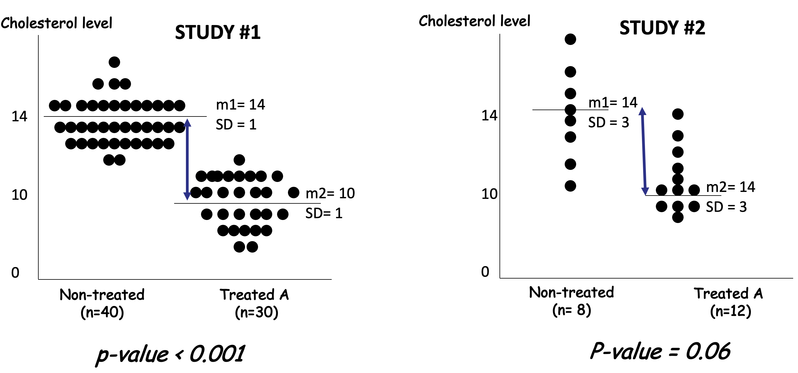
```

In the cholestrol studies presented above, the *p-values* are different, one is smaller than the other (even significant). Although the observed differences in mean are identical. The difference is the same in study 1 and 2 ($\delta=4$). The differences between the two studies are on the standard deviations of the samples and the sample sizes which affect the t-statistics. 

## Risk $\alpha$ and risk $\beta$

**Why do we not accept H0?**

As mentioned earlier there is always a risk of being wrong (Figure \@ref(fig:riskdecision)) but that risk cannot be computed. It is $\beta$. 

In row the unknown truth, in column the conclusion of the test.


```{r riskdecision, fig.cap='Where do the risks stand?', out.width='50%', fig.asp=.75, fig.align='center', echo=F}
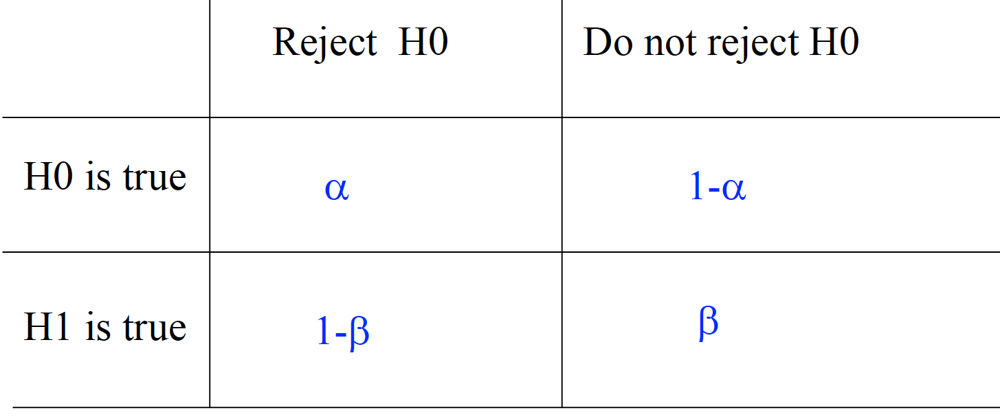
```


- $\alpha$ is the probability of rejecting H0, when H0 is true (Figure \@ref(fig:alphavisual))
- $\beta$ is the probability of failing to reject H0, when H1 is true (Figure \@ref(fig:betavisual))


```{r alphavisual, fig.cap='Population versus when it does not exist', out.width='40%', fig.asp=.75, fig.align='center', echo=F}
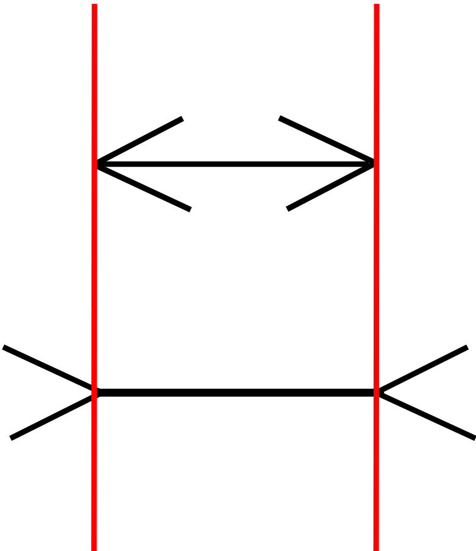
```

Imagine that you are the "eyes" and you are unable to see the perspective above the horizon. You will believe that the 2 lines make 1 and that they are of the same length but in reality the further away is longer. That is the $\beta$ risk. 

```{r betavisual, fig.cap='Not seeing a difference when it does exist.', out.width='40%', fig.asp=.75, fig.align='center', echo=F}

```

**What do you prefer $\alpha$ or $\beta$ ?**

It is a difficult question.

::: {.example}
**Example 4:** Hepatitis B vaccination and multiple sclerosis. Many study protocols have been conduct to assess an possible association between vaccination against Hepatitis B and the development of multiple sclerosis. The null hypothesis was that prevalence of multiple sclerosis was the same among people vaccinated against Hepatitis B and people not vaccinated against Hepatitis B.  


In that context, what would you favour $\alpha$ or $\beta$?
::: 

- Wrongly reject H0 and conclude that there is an effect : it could be catastrophic as the immunization coverage will fall down
- Not seeing an effect: people may not get Hepatitis B vaccination but multiple sclerosis   !!!

Note that there have been many studies on the above question and that no effect as been seen so far. 


::: {.practice}
You test the hypothesis of an absence of difference in school grades between gender. What is your conclusion if:  

- $p-value = 0.049$

- $p-value = 0.051$

Comment on your conclusions.
::: 


## Comparison of multiple groups {#multi-comp}

::: {.example}
**Example 5:**  We are interested in the effect of 2 treatments to gain weight. The protocol include treatment A, treatment B, and a placebo group. We would like to compare the weights between the 3 groups.  

How do we compare the means?  Can we do 2 by 2 comparisons?  
::: 

Table 1: Effects of 2 treatments to gain weight

Parameters|Treatment A|Treatment B| Placebo
-------|-------|-------|-------
sample size n  |  62 | 62 | 96                 
mean weight | 66.06 | 63.83 | 62.32      
sd weight |   3.18  | 2.16   | 3.12 


To the above question the answer is "No" : it increases the likelihood of incorrectly concluding that there are statistically significant differences, since each comparison adds to the probability of a type I error, $\alpha$. 

At the end, if $k$ is the number of comparisons, the error rate becomes $1-(0.95)^k$


### Graphical comparison 

A boxplot and whisker plot (section \@ref(plot)) is an ideal graphical representation to compare data series of the same variable between different groups.

```{r, echo = F, warning=FALSE, message=FALSE}
library(reshape2)
set.seed(128)
A = rnorm(62,65,3)
B = rnorm(62,64,2)
P = rnorm(62,62,3)
## combining data
treat = list("A"=A,"B"=B,"P"=P)
treatFrame = melt(treat)
colnames(treatFrame) =c("Weight","Treatment")
treatFrame$Treatment = as.factor(treatFrame$Treatment)
```

```{r boxplotanova, fig.cap='Boxplot and whisker plot of the effect of different treatments on gain weight', eval = T,  out.width='60%', fig.asp=.75, fig.align="center", echo=F}
## Data analysis with ANOVA
library(ggplot2)
ggplot(treatFrame, aes(y=Weight, x=Treatment)) + 
  geom_boxplot() 
```

Figure \@ref(fig:boxplotanova) shows that the distributions seems to differ. The median (black line with the box) are located at differ weight.

::: {.practice} 
What are the IQR of the 3 groups?
::: 

In Figure \@ref(fig:boxplotanova) the medians are not in the middle of the box. This suggest that the distributions might be skewed.  


Figure \@ref(fig:densityanova) presents density plots, similar to histograms, and reveals the same thing. 

```{r densityanova, fig.cap='Density plots of the effect of different treatments on gain weight', eval = T, echo=F, out.width='60%', fig.asp=.75, fig.align="center"}
## Data analysis with ANOVA
ggplot(treatFrame, aes(x=Weight, fill=Treatment)) + 
  geom_density(alpha=0.5) 
```

The next step is thus to statistically test the hypothesis of equality of means.

### Analysis Of Variance

The Analysis Of Variance or ANOVA allows comparing multiple groups 

::: {.define}
The Analysis Of Variance or ANOVA systematically compare variability *within* and *between* groups. When the variations observed between groups is greater than the within group variation, at least one group is differ from the other.
::: 

The statistical hypotheses are:  
- H0: $\mu1 = \mu2 = \mu3 ... = \mu k$  with $\alpha$=5%  
- H1: At least one mean is different from the other

where $k$ is the number of independent groups


To that aim we use the F-test (named in honor of Sir Ronald Fisher). The F-statistic is a ratio of two variances that examine variability.  


::: {.center}
$F = \frac{Mean Square Between}{Mean Square Error}= \frac{MSB}{MSE}$  
::: 

-  between groups being compared   (Mean Square Between or Mean Square Treatment)
-  within the groups being compared (Mean Square Error or Mean Square Residuals)


Mean Squares | Sums of Squares (SS) | DF | 
---------------------|--------------------|--------------
MSB = SSB/(k-1) | $SSB = \sum_{i=1}^k n_i(\bar{X_i}-\bar{X})^2$  | k-1  
MSE = SSE/(N-k) | $SSE = \sum_{i=1}^k\sum_{j=1}^n(X_{ij}-\bar{X_i})^2$ | N-k
total  | $SST = \sum_{i=1}^k\sum_{j=1}^n(X_{ij}-\bar{X})^2$ | N-1

where  


DF = degree of freedom
$X_{ij}$ = individual observation *j* in treatment *i*   
$\bar{X_i}$ = sample mean of the $i^{th}$ treatment (or group/sample)   
$\bar{X}$ = overall sample mean  
k = number of treatments or independent groups  
n = number of observations in treatment *i*
N = total number of observations or total sample size  

In practice with R
```{r, echo=T, eval=T}
res <- aov(Weight ~ Treatment, data=treatFrame)
summary(res)
```


The F-value is the F statistics. The F-value = 16.48 (=135.26/8.21). To conclude under H0 and a given $\alpha$ risk, we can try to look for the appropriate statistical law and its associated table or we can conclude using the p-value.

::: {.practice}
The  $p-value = 2.62e^{-07}$. What is your conclusion?
::: 


### Post-hoc analysis and ANOVA assumptions

The ANOVA results might help you conclude that a least one group varies differently that the others. However you will not know which group. To that aim you, need to perform a post-hoc analysis using the
TukeyHSD's test.  


In practice with R
```{r, echo=F}
TukeyHSD(res)
```

The output of the TukeyHSD's test presents adjusted p-values (p adj) for the two groups comparisons. In addition is displayed the difference in means (diff) and the lower (lwr) and upper (upr) bounds of the 95% CI on the difference in means.

In example 5, Owing the TukeyHSD's test, it seems that all means are differ from one another.  


That is if we trust the appropriate use of the ANOVA and TukeyHSD's tests...


The ANOVA analysis relies on several **assumptions that need to be tested before** computing the ANOVA. The ANOVA formula is a based on mean and variance that can only be used if the distributions are not too different from the Normal distribution. It is a parametric test (see section \@ref(paranonpara)). Before the ANOVA we need to verify with prior statistical tests that:  


1. the outcome variable should be normally distributed within each group (*Shapiro test*)

2. the variance in each group should be similar (e.g. *Bartlett or Levene test*)

3. the observations are independent (not correlated or related to each other)

However, the F-test is fairly resistant or robust to violations of assumptions 1 and 2.

## Parametric and non-parametric test {#paranonpara}

Parametric tests are those that make assumptions about the parameters of the population distribution from which the sample is drawn. This is often the assumption that the population data are normally distributed. Non-parametric tests are "distribution-free" and, as such, can be used for non-Normal variables. Non-parametric tests are often based on the ranking of the values in the data serie.

For the non-parametric the hypothesis are:

H0: The two samples are from the same distribution  

H1: one distribution is shifted in location higher or lower than the other  


While for the parametric interested in comparing means the hypothesis are:

H0: The two samples have the same mean  

H1: The two samples do not have the same mean  


### Asessing Normality

1. Graphically

Normality can be assess using an histogram or the cumulative distribution function.

In figure \@ref(fig:normality_plotfunction), the data normally distributed are on the left where the histogram is symmetric and the cumulative distribution function has a S shape. On the right, the data not normally distributed present a skewed histogram and cumulative distribution function different from a S shape.

```{r distribution function, fig.cap='Assessing normality using graphics', out.width='40%', fig.asp=.75, fig.align='center', echo=F}
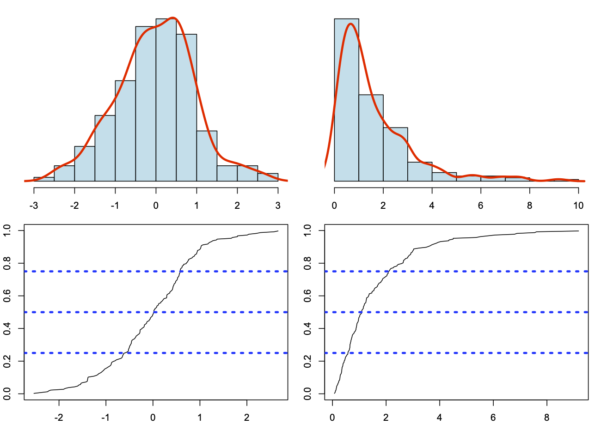
```

Note that in the skewed distribution, the mean will be largely different from the median and the mode parameters.

2. Statistically

The Shapiro-Wilk test or Kolgomorov-Sminorv can be used do verify the normality a distribution. THe statistical hypothesis is:

H0: The sample distribution is equal to the Normal distribution  

H1: The sample distribution is different from the Normal distribution  


As an example, we randomly generate values drawn from a Normal distribution and test the Normality.

```{r shapiro}
# Generating numbers following a Normal distribution
data <- rnorm(100)
# Using Shapiro-Wilk's test
shapiro.test(data)
# Using Kolgomorov-Smirnov's test
ks.test(data, "pnorm")
```

What is your conclusion?

Note that the advantage of the Kolgomorov-Smirnov's test is that it can help assessing other  type of distributions than the Normal distribution.

```{r Kolgomorov}
# Generating numbers following an Uniform distribution
data <- runif(100)
# Using Kolgomorov-Smirnov's test for Normality 
ks.test(data, "pnorm")
# Using Kolgomorov-Smirnov's test for Uniform distribution 
ks.test(data, "punif")
```

What are your conclusions?

### Two-sample Wilcoxon test (or Mann-Whitney U test)

- Given two samples X et Y 
- Sort in increasing order the data from X and Y
- Give a rank to the values
- Compute the sum of rank for each sample R1 and R2
- Compute the random  variable Un1,n2 = min(Un1, Un2) and the associated Z statistics

```{r wilcoxon, out.width='60%', fig.asp=.75, fig.align="center",echo=F}
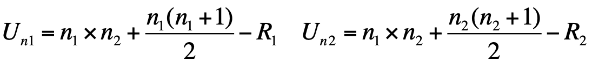
```


```{r zwilcoxon, out.width='40%', fig.asp=.75, fig.align="center",echo=F}
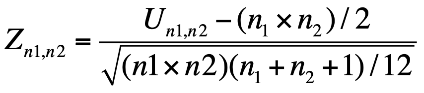
```

If n1 and n2 < 20,  Mann-Whitney's table   

IF n1 and n2 > 20, Normal law table  


::: {.example}
**Example:**

Among diabetes patients, is there a difference in age at diagnosis between men and women? 

- Women: 20 11 17 12
- Men: 19 22 16 29 24

Sorting data:  11 12 16 17 19 20 22 24 29  

R1 = 1+2+4+6 = 13 and Un1 = 17  

R2 = 3+5+7+8+9 = 32 and Un2= 3  


Table de Mann-Whitney p-value =0.11

What is you conlusion?
::: 


### Which test to use?

**Non-parametric tests are valid for both non-Normally distributed data and Normally distributed data, so why not use them all the time?**

When it is possible to perform both a parametric and a non-parametric test (because we have quantitative measurements) reducing the data to ranks and using the Wilcoxon/Mann-Whitney test will have about 95% of the power of a corresponding two-sample t-test. And, as we have seen,
often outliers are interesting in their own right. An analysis that simply ignores them
may miss an important fact or instance.


Parametric | Non-Parametric equivalent
-----------|-------------------------
Paired t-test | Wilcoxon rank sum test*
Unpaired t-test | Mann-Whitney U test* 
Pearson correlation | Spearmann Correlation
One analysis of variance | Kruskal Wallis test

*In R statistical software, see Wilcoxon.test() and the arguments