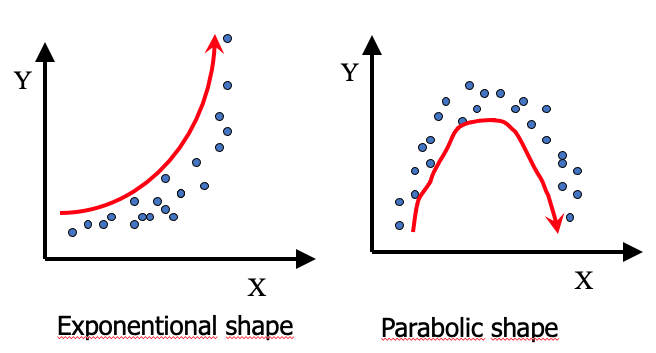
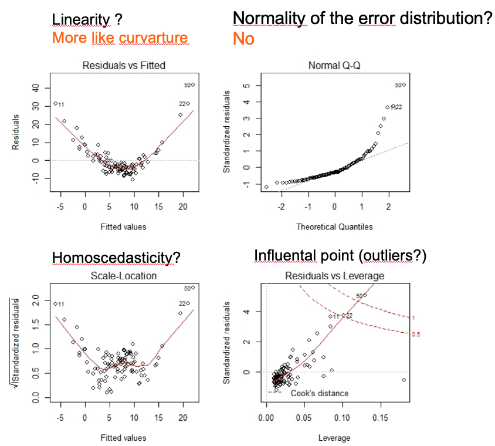
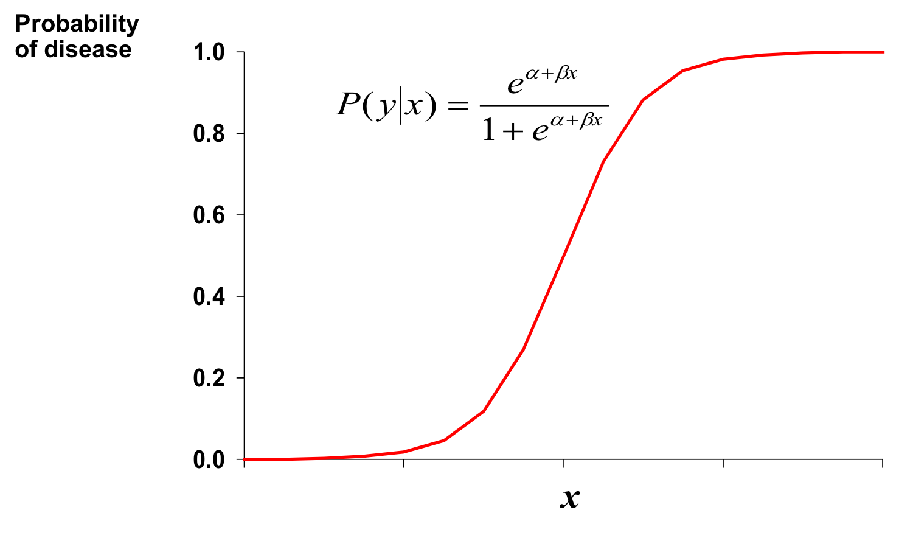
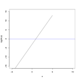

# Introduction to regression modelling

::: {.objective}
- the step by step procedure to obtain an informative linear model, assess its validity and interpret it
- Interpret results of a simple linear model
- Discuss significance of a simple linear model
:::


## Simple linear regression {#simplelm}

::: {.define}
A regression attempt to explain the variations observed for a variable by other variables
::: 

In the plot below, we try to explain the observed distances to stop for cars by the speed of the cars. Here between the two variables, we see a rather linear diagonal trend. We may be able to fit a **simple linear regression** model.

```{r speed dist, fig.align="center", echo=FALSE}
data(cars)
library(ggplot2)
ggplot(cars, aes(speed, dist)) + geom_point() + ggtitle("Distance to stop (ft) and speed of cars (mph) in the 1920s") + xlab("Speed of the cars (mph)") + ylab("Distance to stop (ft)")
```

::: {.define}
A simple linear regression model is a statistical model that attempt to fit a linear relationship between two variables: one to explain and one explanatory variable
::: 

By convention:  

- **Y axis** presents the variable to explain also named the dependent variable, the outcome variable or the response variable  
- **X axis** presents the explanatory variable also named the independent variable or the predictor variable.  

A first measure of linear relationship, often wrongly used, is the coefficient of correlation.

### Pearson's coefficient of correlation

When we talk about correlation we often talk about the Pearson's coefficient of correlation that quantify the linear association between two quantitative variables.

Mathematically, the coefficient of correlation is the  standardized covariance (Equation \@ref(eq:r)). While the covariance is the average the product of the deviations of observed values to their mean (Equation \@ref(eq:cov)).  

\begin{equation}
r = \frac{cov_x,_y}{s_xs_y} (\#eq:r)
\end{equation}

\begin{equation}
cov(x,y) = \frac{\sum{(x_i-\bar{x})(y_i-\bar{y})}}{N-1}  (\#eq:cov)
\end{equation}

::: {.define}
The coefficient of correlation *r* is :  

- Dimensionless  
- Range between -1 and 1  
- its absolute value presents the force of the relationship  
- its sign presents the direction of the relationship  
::: 

::: {.practice}
In the graphics below, what would be the estimated value of the Pearson's coefficient of correlation? 
:::

```{r correlation plot, fig.align="center", echo=FALSE}
knitr::include_graphics('fig/coef_correlation.png')
```


::: {.caution}
Absence of linear association (r=0) does not mean absence of relation.
:::

```{r correlation plot2, fig.align="center", echo=FALSE}

```


::: {.caution}
Correlation does not mean causation.
:::

For details and other examples on too fast conclusions  or spurious correlations  see PennState Eberly College of Science [@STAT501] and Tyler Vigen's Website [@SpuriousCorrelation].


### Simple linear regression model

A simple linear model fit a line between the points of the two variables. The final equation is of the form:

\begin{equation}
Y = \beta_1X + \beta_0 + \epsilon  (\#eq:lm)
\end{equation}

Which line fits best ?

```{r speed2, fig.align="center", echo=FALSE}
ggplot(cars, aes(dist, speed)) + geom_point() + ggtitle("Distance to stop (ft) and speed of cars (mph)") +
  geom_segment(aes(x = 0, y = 5, xend = 90, yend =25, colour = "red")) +
  geom_segment(aes(x = 25, y = 5, xend = 50, yend =25, colour = "red")) +
  geom_segment(aes(x = 0, y = 7.5, xend = 90, yend =20, colour = "red")) +
  geom_segment(aes(x = 50, y = 5, xend = 27, yend =20, colour = "red"))
```

Of all possible lines, the **regression line is the one that is the closest on average to all the points.**

```{r, fig.align="center", echo=FALSE}
knitr::include_graphics('fig/regression_residuals.png')
```

The fitting of the regression line is based the least squares criteria. The aim is to minimize the sum of square distance between observed values and fitted values on the line (Equation \@ref(eq:sse)). The sum of square distance also named sum of square Error (SSE) or sum of square residuals (SSRes). When SSE is minimum it implies that the variance of the residuals that remain to be explained are fit to the minimum. 


\begin{equation}
SSE=\sum_{i=1}^{n}{(y_i-\hat{y_i})^2} (\#eq:sse)
\end{equation}

To fit a simple linear regression with R follow the example below:

```{r}
# load the data
data(cars)
# fit the line
m1 <- lm(dist ~ speed, data=cars)
# display the results
summary(m1)
```

The output tells us that:

- Y(distance to stop) = 3.93*X(speed) -17.57(intercept) + $\epsilon$
- If a car increases its speed by 1 mph, its distance to stop increases by 3.93 ft.
- This estimated coefficient is significantly different from 0 ($Pr(>|t|) = p-value = 1.49e^{-12}$)
- The model explain 64% of the observed variance in distances to stop for cars (Adjusted R-squared or coefficient of determination $R^2$).


The residuals are leftover of the outcome variance after fitting a model. They are use to:  

- Verify if linear regression assumptions are met {\@ref(posthocreg)}
- Show how poorly a model represents data
- Reveal unexplained patterns in the data by the fitted model 
- Could help improving the model in an exploratory way.


### Post-hoc assumptions verification {#posthocreg}

How to verify if a simple linear regression model was appropriate? 

The method is descriptive and based on the distribution of the residuals that allows assessing:

- Linear and additive of predictive relationships
- Homoscedasticity (constant variance) of residuals (errors)
- Normality of the residuals distribution
- Independence (lack of correlation) residuals (in particular, no correlation between consecutive errors in the case of time series data)

Using R:

```{r, warning=FALSE, message=FALSE, comment=FALSE}
# Define a plotting area with 4 panels
layout(matrix(1:4, nrow=2))
# Ask for diagnostic plots for linear regression
plot(m1)
# Set back the plotting area to 1 panel
dev.off()
```

From top to bottom and left to right the plots assess :

(1) Linearity and additivity of predictive relationships. A good fitting should show a red horizontal line, the variance of the residuals is randomly spread above and below the horizontal line.
(2) Homoscedasticity (*i.e.* constant variance) of residuals (errors). A good fitting should show a red horizontal line, the variance of the residuals is constant and do not depend on the fitted values.
(3) Normality of the residuals distribution. A good fitting should show a alignment of the dots on the diagonal of the Q-Q plot.
(4) Influential observations with Cook's distance: if dots appear outside the Cook's distance limits (red dashes) they are influential observations or even outliers (extreme). Their value need to be verified as they might negatively influence the fitting.

::: {.practice}
What do you think of the model above?
:::

Below is an example of post-hoc assumptions verification of a linear model that shows problems. Here the model need to be refined or done differently. 

```{r, fig.align="center", echo=FALSE}

```


## Multiple linear regression model

::: {.define}
A multiple (or multivariate) linear regression model is a statistical model that attempt to fit a linear relationship between one outcome variable to explain and several explanatory variables (determinants).
:::


For instance, do your age and your height predict your lung capacity?

```{r, echo=F}
LungCapData =read.csv("LungCapData.txt", sep="\t", header=T)
```

The table below presents the lung capacity dataset shared by Mike Marin and  Ladan Hamadani and available at  http://www.statslectures.com/ 
[@STATOnline]. The first column is the lung capacity outcome variable and the other columns are some possible determinants. 
```{r, echo=FALSE}
library(kableExtra)
kable(head(LungCapData))
```

First, we have a look at the two first covariates along with the outcome variable using a pair plot to visually assess any linear relationship.

```{r, message=F, warning=FALSE}
pairs(LungCapData[,c("LungCap", "Age","Height")], lower.panel = NULL)
```

We could also look at each covariate against the outcome variable using a simple linear regression. However we will miss some information. Maybe it is better to be tall than small to have a large lung capacity whatever your age. To test this hypothesis we should apply a multivariate regression on the ouctome variable.

Mathematically, **a multivariate regression is a generalization of a simple linear regression**.  

From one predictor ...  

\center$y_i=\beta_0 + \beta_1x_{i1} + \epsilon_i$

\center... to two or more predictors

\center$y_i=\beta_0 + \beta_1x_{i1} + \beta_2x_{i2} + ...+ \beta_kx_{ik} + \epsilon_i$

and the independent error terms $\epsilon_i$ follow a normal distribution with mean 0 and equal variance $\sigma^2$.

The R function calls for a multiple regression is similar to a simple linear regression. First you build the model adding up the covariate on the right hand side of the equation. Next you display the summary and interpret the coefficients.
```{r}
model3 = lm(LungCap ~ Age + Height, data= LungCapData)
summary(model3)
```

- **P-values** for the *t-tests* appearing in the table of estimates suggest that the slope parameters for Age and Height  are significantly different from 0 ($p-value < 0.05$).  
- **Residual standard error** of 1.056 is rather small
- **F-statistic** ($1938$) is highly significant  ($p-value: < 2.2e-16$) implying that the model containing Age and Height is more useful in predicting lung capacity than not taking into account those 2 predictors. (Note that this does not tell us that the model with the 2 predictors is the best model!)
- **Multiple R squared**:  R-squared measures the amount of variation in the response variable that can be explained by the predictor variable. The multiple R-squared is for models with multiple predictor variables. When adding up predictors, the multiple Rsquared increases, as a predictor always explain some portion of the variance.
- **Adjusted Rsquared**: is the R-squared corrected for multiple predictors' side-effect. It adds penalties for the number of predictors in the model.  It shows a balance between the most parsimonious model, and the best fitting model. 

\center$adj R^2 = 1 - \frac{n-1}{n-(k+1)}.(1- R^2)$  


where n: size of the sample  and k: number of independent variables

Generally, if you have a large difference between your multiple and your adjusted R-squared that indicates you may have overfitted your model.

In model3, when age increases by one year, the lung capacity increases by 0.12, all other things (height) being equal for the persons in the population. When  height increases by one unit, the lung capacity increases by 0.27, all other things (height) being equal for the persons in the population.

Once a model is built, we can use it for prediction.

You can **predict at the population level** with the estimation of the confidence interval for the **mean response**
```{r}
new = data.frame("Age"=30, "Height"=70)
predict(model3, new, interval="confidence")
```
We can be $95\%$ confident that the average lung capacity score for all persons with age = 30 and height = 70 is between 10.99 and 12.07.

You can **predict at the individual level** using the prediction interval for a **new response**
```{r}
predict(model3, new, interval="prediction")
```
We can be $95\%$ confident that the lung capacity score of an individual with age = 30 and height = 70 will be between 9.39 and 13.67


## Logistic regression model {#logistic-regression-model}

::: {.define}
Logistic regression is a process of modeling the probability of a categorical outcome given an input variable.  
:::

The most common logistic regression is the binary logistic regression that models a binary outcome (ex: Dead/Alive, yes/no). Multinomial (or polychotomous) logistic regression can model scenarios where there are more than two possible modalities/outcomes (ex: low, medium, high) for the categorical variable. 

As an example, let's investigate the risk factor of chronic kidney disease (CKD).The response variable is either 1 (Affected) or 0 (Not affected) - a dichotomous response. By definition, that's a categorical response, so we can't use linear regression methods to predict it.

When coding the outcome variable 0 and 1 we can still represent what is happening in association with a covariate such as age but we cannot draw an simple line. 
```{r, echo=FALSE, warning=FALSE, message=FALSE}
ckd <- read.csv("ckd-dataset.csv", skip=2,  col.names=c("Diastolic","bp.limit",       "sg","al","class","rbc","su","pc","pcc","ba","bgr","bu","sod","sc","pot","hemo","pcv","rbcc","wbcc","htn","dm","cad","appet","pe","ane","grf","stage","affected","age" ), stringsAsFactors = TRUE)
ckd <- ckd[-c(1,2), ]
ckd$affected <- as.numeric(ckd$affected)
ckd$ckd <- ifelse(ckd$affected== "0", 0, 1)
ckd$age2 <- NA
ckd$age2[ckd$age =="< 12"] <- sample(9:11, 4, replace = T)
ckd$age2[ckd$age =="≥ 74"] <- sample(75:85, 10, replace = T)
ckd$age2[ckd$age =="12 - 20"] <- sample(12:19, 4, replace = T)
ckd$age2[ckd$age =="20 - 27"] <- sample(20:26, 10, replace = T)
ckd$age2[ckd$age =="27 - 35"] <- sample(27:34, 14, replace = T)
ckd$age2[ckd$age =="35 - 43"] <- sample(35:42, 12, replace = T)
ckd$age2[ckd$age =="43 - 51"] <- sample(43:50, 31, replace = T)
ckd$age2[ckd$age =="51 - 59"] <- sample(51:58, 33, replace = T)
ckd$age2[ckd$age =="59 - 66"] <- sample(59:65, 48, replace = T)
ckd$age2[ckd$age =="66 - 74"] <- sample(66:73, 34, replace = T)
```


```{r plot ckd, message=F, warning=FALSE}
plot(ckd$age2, ckd$affected, ylab="Affected", xlab="age (in years)", pch="*")
```

We can see that the proportions (or probabilities) of having the disease must lie between 0 and 1. It corresponds to the prevalence (%) of CKD according to age.

This relationship can be model using the Logistic function.

- $Y = \frac{1}{1 + e^{-(\beta_0 + \beta_1X)}}$

```{r, out.width='60%', fig.asp=.75,fig.align="center", echo=FALSE}

```

- $\beta_0$ and $\beta_1$ give the shape of the curve


```{r, out.width='60%', fig.asp=.75,fig.align="center", echo=FALSE}
knitr::include_graphics('fig/logReg-param.png')
```


We note the the $\beta_0 + \beta_1X$ part looks really similar a  linear model. In fact, to estimate those coefficients the mathematical trick is to transform the above equation in order to get to a linear form.

By transformation:

- First we compute the odds of the disease

$Y/(1-Y) =  \frac{1}{e^{-(\beta_0 + \beta_1X + \beta_2x_2 + ... +\beta_ix_i)}}$

```{r, fig.align="center", echo=FALSE}
knitr::include_graphics('fig/logReg2.png')
```

- Second we compute the Logit

$ln(Y/1-Y)=\beta_0 + \beta_1x_1 + \beta_2x_2 + ...\beta_ix_i$

```{r, fig.align="center", echo=FALSE}

```

$\beta_0$ =  log odds of disease in unexposed

$\beta_i$ =  log odds ratio associated with being exposed to *i* (age for instance)

The *Logit function* is defined as the natural log of the odds. A probability of 0.5 corresponds to a logit of 0, probabilities smaller than 0.5 correspond to negative logit values, and probabilities greater than 0.5 correspond to positive logit values. 

After fit the model and estimating the $\beta_0$ and $\beta_1$ coefficients, we can retrieve the Odds Ratio (OR) which is the Probability of having the outcome / Probability of not having the outcome when exposed compare to the Probability of having the outcome / Probability of not having the outcome when unexposed :

::: {.define}
OR= $e^\beta_i$ = odds ratio associated with being exposed to *i*
::: 

```{r, echo=TRUE}
# Can age contribute to the onset of the disease? 
model_ckd <- glm(affected  ~ age2, family=binomial("logit"), data=ckd)
summary(model_ckd) 
```

The coefficient for age is positively link to the disease. When you increase in age you increase your risk of having disease. To compute the OR, we can use the $exp(0.039)$ but for a nicest output with confidence interval we can use the *epiDisplay* library and its *logistic.display()* function.

```{r, echo=TRUE}
# Loading the epiDisplay library in the R environment
library(epiDisplay)
logistic.display(model_ckd) 
```

The odd (risk) of having the disease is 1.04 times higher when people get older by 1 year (95%CI[1.02,1.06]). The P(Wald's test) tells us that the estimated coefficient is different from 0 (or the OR is different from 1). The  P(LR-test) log-likelihood ratio test tells us that the model is better than the NULL model (without any covariate).

We can add other covariates and then use a stepwise approach to get the most parsimonious model.

```{r, echo=TRUE}
model_ckd2 <- glm(affected  ~ age2 + bp.limit, family=binomial("logit"), data=ckd)
summary(model_ckd2)
model_ckd2<- step(model_ckd2)
# The best model is with the smallest AIC
# It is the model without removing any variable (<none>)
logistic.display(model_ckd) 
```


## Collinearity

::: {.define}
Collinearity is the correlation between 2 independent variables (predictors).  

Multi-collinearity is cross-correlation between multiple independent variables (predictors).  
:::


If the independent variables are perfectly correlated, you will face these problems:

- Inflated coefficients  
- Values and signs of the coefficients are incoherent with common knowledge  
- Underestimated Student T test (non-significant p-values)  
- Unsteady results, adding or deleting observation strongly modify the values and signs of the coefficients  

## Detecting (multi-)collinearity

### Coefficient of correlation and visual assessment 

Is there a problem in our example? Is Age too highly correlated with height?
```{r, message=F,warning=FALSE}
plot(LungCapData$Age, LungCapData$Height)
```

A test over the coefficient of correlation can be performed where:  

- H0: the coefficient of correlation r = 0  
- H1: the coefficient of correlation r != 0  

with $\alpha < 0.05$

```{r}
cor.test(LungCapData$Age, LungCapData$Height)
```

Note that even a small correlation between 2 variables and thus the test over the coefficient of correlation statistically significant.

### Variance Inflation Factor 

Therefore other metrics can be computed. The most commun one is the Variance Inflation Factor or **VIF** and its inverse the Tolerance indicator or **TOL**

::: {.define}
  
Variance Inflation Factor (**VIF**): how much of the inflation of the standard error could be caused by collinearity  

Tolerance indicator (**TOL**) = $\frac{1}{VIF}$ 
:::

If all of the variables are orthogonal to each other (uncorrelated with each other) both indicators (TOL and VIF) are 1.  

If a variable is very closely correlated to another variable, the TOL goes to 0, and the VIF gets very large. An independent variable with a VIF > 10 (empirical threshold) should be look at and some remedial measures might have to be taken.

Using the R *mctest* library and the *imcdiag()* function on your model you will get the VIF and TOL metrics and others. See help for interpretation of the others measures.
```{r}
library(mctest)
imcdiag(model3)
```

### Remedial measures

The remedial measures to manage collinearity could be :  

- Manual exclusion:  VIF values  above 10 and as well as the concerned variables logically seem to be redundant. You remove one of them.
- Aggregation: The two redundant variables could be summarized into an third variable using statistical methods such as Principal Component Analysis (PCA). That third variable will then be used in the model in place of the first two.
- Automatic variable selection: you let the modeling algorithm able the issue using stepwise regression which might remove variables that generate unstable modeling results


## Explanatory variable selection

When defining a model you would like to either obtain the best explanatory model (goodness of fit) or the best predictive model (parsimonious). To this aim you need to select the most relevant variables. If you add all the variables you have in hand it might be one too many. The number of degrees of freedom will decrease and as the consequence the residual variance could increase.    

How to select the contributing variables?  


- Some variables are correlated with redundancy of information: the variables with the effect the easiest to explain/express should to be kept.  
- Univariate tests (e.g., outcome vs exposition) are highly recommended prior building the model. Results with a p-value > 0.25 or 0.20 (empirical cut-off) is less likely to contribute to explain the outcome in a larger model. You might not want to include it in the full model. However, note that even so a variable shows a p-value > 0.25 in an univariate test you might still want to force it in the model because of inconsistency with your prior knowledge (literature, own studies).  
- Automatic and iterative procedures for explanatory variable selection based on goodness of fit criterion (e.g., on Akaike's information criterion - AIC)  

### Iterative procedures for explanatory variable selection

These approaches introduced or suppressed variables based on results of nested models tests using goodness of fit criterion. The 3 variants are:

1. Backward procedure
 + First, all of the predictors under consideration are in the model
 + One at a time is deleted the less significant (the "worst")
 + All the remaining variables make a significant contribution 
2. Forward procedure
 + Begins with none of the potential explanatory variables
 + Adds one variable at a time
 + Stops when no remaining variable makes a significant contribution
3. Stepwise procedure
 + Modification of the forward procedure
 + Drops variables if they lose their significance as other are added
 
The goodness of fit criteria is often the Akaike's information criterion or AIC. **The smaller the AIC, the better the fit**.

The R command for the stepwise approach is:

```{r}
# Full model with all the variables you have in hand (or selected after univariate test)
modelFull <-  lm(LungCap ~ ., data= LungCapData)
# The argument direction="both" is for the procedure type. See the help page for more details.
modelStep <- step(modelFull, direction = "both")
```

Here at each iteration one variable is removed and compare to the full model. For example, the line *-Caesarean* indicates that the variable *Caesarean* is removed. The AIC of 38.03 is compared to the AIC 34.43 of the full model ($<none>$ removed). The full model is more informative than the model without the variable *Caesarean*. The interpretation is the same for the rest of the variables.

```{r}
summary(modelStep)
```

###  Goodness of fit analysis

You can perform a goodness of fit analysis step by step using the *anova()* function call between 2 nested models [NOTE: do not mix-up anova() with aov() for the comparison of more than two means].
```{r}
## Model without the Age variable
model4var <-  lm(LungCap ~ Height + Smoke + Gender + Caesarean, data= LungCapData)
summary(model4var)
```

All the variables in the model4var are significant. The *anova()* function compare the full model to the model4var.

```{r}
anova(modelFull, model4var)
```

The 2 models differ (p-value < 0.05). The AIC index highlight the model with the best fit (smallest AIC); here it is the full model.
```{r}
AIC(modelFull, model4var)
```


